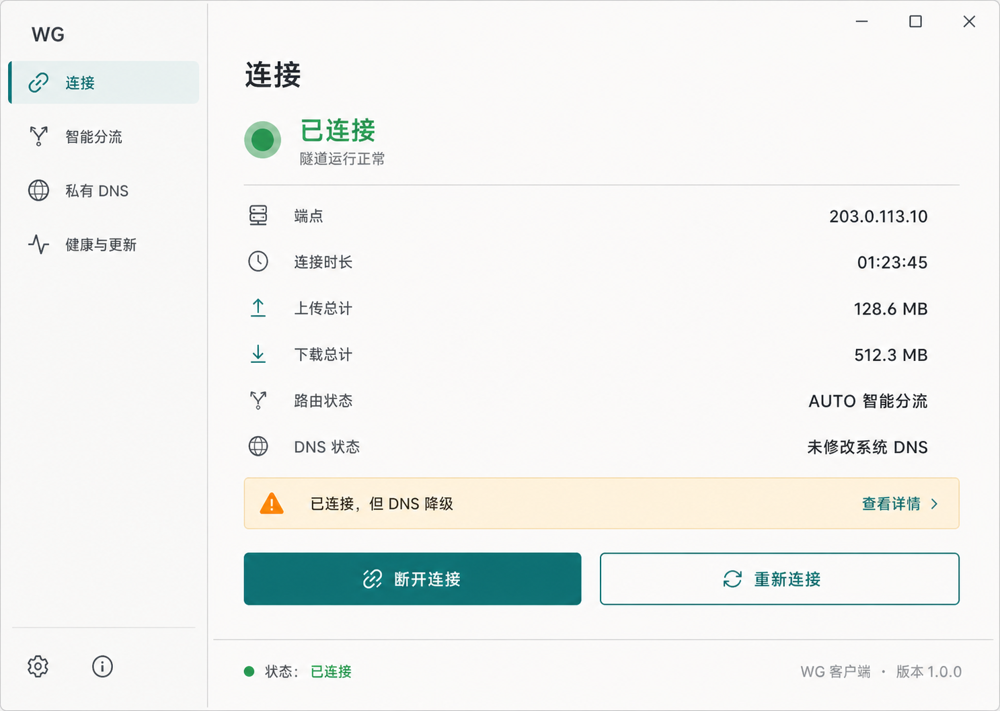
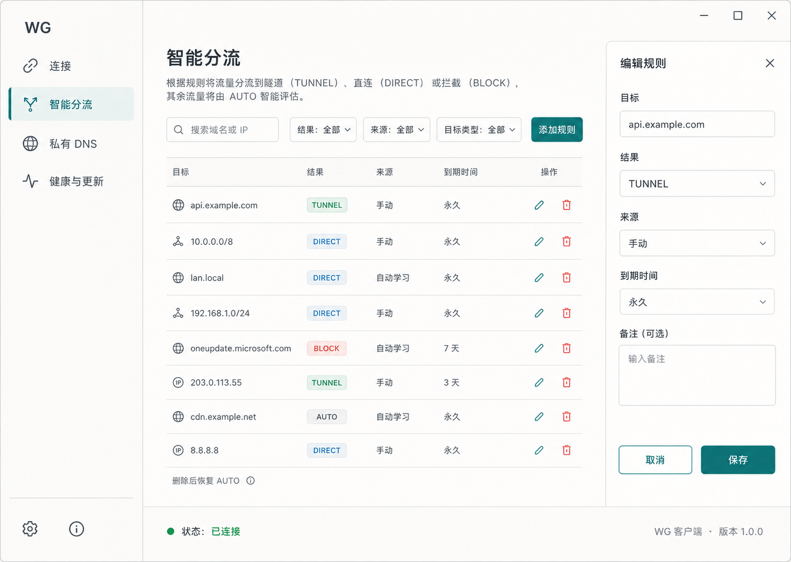
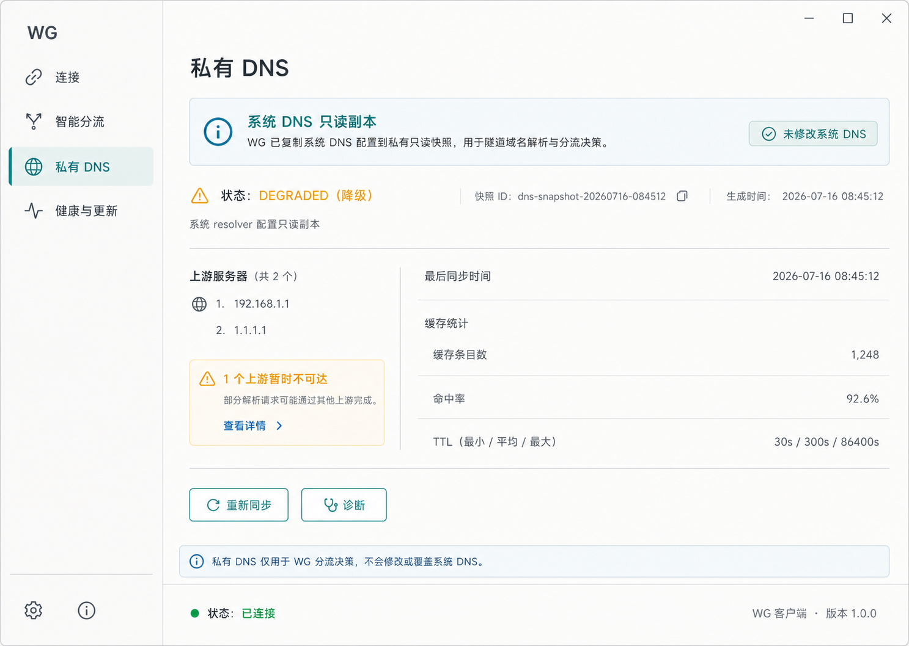
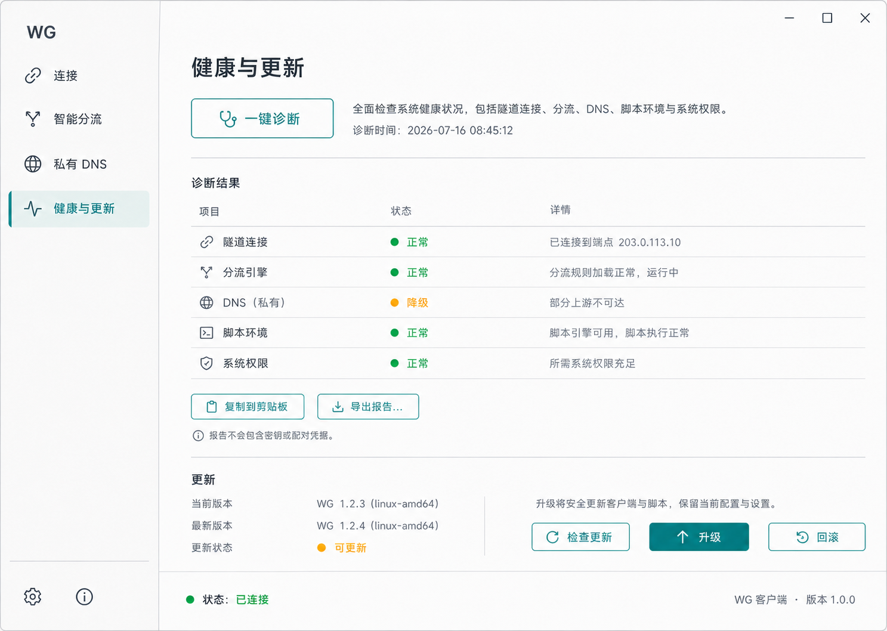
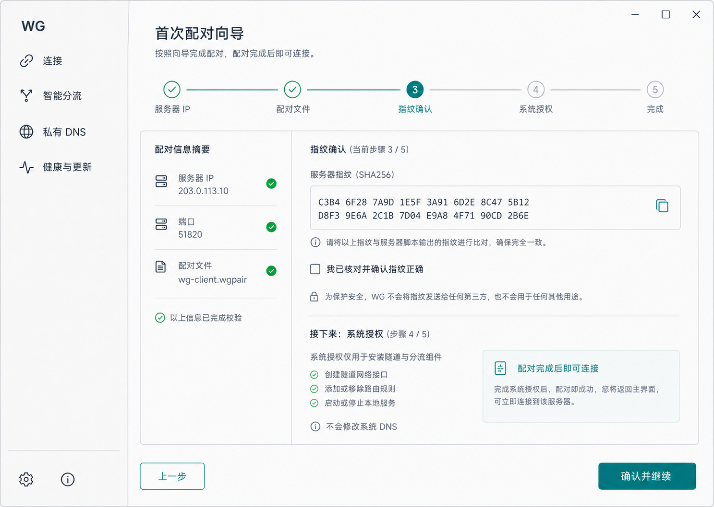

# WG 私有隧道协议工程设计

| 项目 | 内容 |
|---|---|
| 文档版本 | 0.2 |
| 协议代号 | WG/1（WG Private Tunnel Protocol 1） |
| 文档状态 | 工程草案，禁止直接用于生产环境 |
| 目标读者 | 协议开发、Go 客户端与 UI 开发、服务端开发、安全评审、运维 |
| 最后更新 | 2026-07-16 |
| 本次修订 | 客户端统一使用 Go 开发并加入 Linux 桌面 UI；服务端保持脚本与守护进程、无 UI；补充五个客户端页面原型与功能规格 |

> 本文设计一个客户端与自有服务器之间的私人加密 IP 隧道。线上报文格式、WG-HS/1 握手、密钥调度、会话状态机、路由与部署系统均为项目自有设计；底层密码原语采用成熟标准和经过审查的实现。
>
> 本项目用于合法的个人远程访问和自有基础设施连接，不提供匿名性承诺，不以规避网络管理、流量识别或访问控制为目标。
>
> 本文中的 WG 仅表示本项目及其自有 WG/1 协议，不表示任何既有隧道协议，也不与其他协议、配置格式或命令兼容。

---

## 1. 执行摘要

WG/1 是一个基于 UDP 的双端加密 IP 隧道协议。客户端通过虚拟网卡接收操作系统流量，由本地策略引擎决定直连或进入隧道。进入隧道的原始 IPv4/IPv6 数据包经认证加密后发送到自有服务器，再由服务器按授权策略转发。

WG/1 的“自有协议”主要体现在：

- 自定义 WG-HS/1 双向认证握手、转录绑定和密钥标签。
- 自定义固定报文头、连接标识和帧格式。
- 自定义客户端与服务器状态机。
- 自定义地址租约、路径迁移和会话重建流程。
- 自定义可管理的自动智能分流、只读复制系统配置的 WG 私有 DNS 与配置格式。
- 自定义服务器安装、升级、诊断和回滚体系。
- 服务端只暴露 `wg-server` 脚本；客户端提供 WG 桌面 UI 和 `wg-client` 脚本，统一隐藏密钥、配置、TUN 和服务管理细节。

WG/1 的密码学边界是：

- 不直接复用 Noise、TLS、DTLS、QUIC 或其他既有隧道协议的完整握手协议。
- 自有部分限于握手消息、转录、密钥调度、状态机和线上编码。
- 不自行实现椭圆曲线、AEAD、哈希或随机数等底层密码原语。
- 不使用共享口令直接生成长期密钥。
- 不把协议保密当作安全边界。

固定密码学核心是：

- 自有握手与密钥调度：WG-HS/1。
- 密钥协商：X25519。
- 认证加密：ChaCha20-Poly1305。
- 哈希与握手派生：BLAKE2s-256 和 HKDF-BLAKE2s-256。
- 随机数：操作系统密码学安全随机源。

WG-HS/1 属于新的密码协议组合。完成公开规格、测试向量、形式化分析、实现审计、模糊测试和至少一次独立密码学评估前，只允许实验室使用。

---

## 2. 目标与边界

### 2.1 产品目标

WG/1 必须实现：

1. 一个客户端安全连接一台自有服务器。
2. 客户端和服务器双向身份认证。
3. 对隧道内 IP 数据的机密性、完整性和来源认证。
4. 防止已接收报文被再次利用。
5. 支持网络丢包、乱序、NAT 映射变化和客户端地址变化。
6. 自动智能判定 DIRECT、TUNNEL 或 BLOCK，并允许通过客户端 UI 或脚本管理域名、IP 和 CIDR 覆盖项；删除最后一个匹配用户来源后恢复 AUTO。
7. 只读复制系统 DNS 配置到 WG 私有 DNS，任何生命周期操作都不修改系统 DNS。
8. 支持 IPv4；正式版必须明确处理 IPv6，不能静默泄漏。
9. 提供可重复、可升级、可卸载、失败可回滚的 `wg-server` 与 `wg-client` 脚本。
10. 默认最少日志，不记录用户访问的完整域名或目的地址。
11. 单台服务器、少量受控客户端的稳定运行。

### 2.2 非目标

WG/1 第一版不实现：

- 自创底层密码算法或自创密码学原语。
- 多跳匿名网络。
- 面向公众出售或开放共享节点。
- 伪装成其他协议、域名前置、端口跳变或主动对抗流量识别。
- 恒定速率填充、流量形状混淆或不可识别性承诺。
- TCP 式可靠传输层。
- 服务器之间的集群、自动选路或全球节点调度。
- 企业级账号体系、计费、配额和网页管理后台。
- 对已被控制的客户端或服务器提供保护。

### 2.3 成功定义

项目只有在满足以下条件后，才可称为“可用”：

- 任意一端身份不匹配时不能建立会话。
- 报文被篡改、截断或重放时必须被拒绝。
- 同一流量密钥下绝不重复使用 nonce。
- 隧道指定流量在连接失败时按配置阻断，不能意外直连。
- 服务器不能被授权客户端用作访问其云内网或元数据地址的跳板。
- 用户删除分流覆盖项后不影响共享 IP 的其他有效来源；最后一个匹配用户来源消失后目标恢复 AUTO。
- 安装、运行、升级、回滚和卸载前后，WG 不改变系统 DNS 配置或缓存。
- 安装、升级和卸载都可在干净系统与已有配置系统上重复执行。
- 协议解析器通过持续模糊测试。
- 安全评审没有未解决的严重或高危问题。

---

## 3. 规范用语

本文中的“必须”“禁止”表示实现不可偏离的要求；“应当”表示除非有明确、记录在案的理由，否则必须遵循；“可以”表示可选能力。

缩写：

| 缩写 | 含义 |
|---|---|
| AEAD | 带关联数据的认证加密 |
| CID | 连接标识 Connection ID |
| CSPRNG | 密码学安全伪随机数生成器 |
| DCID | 目的连接标识 |
| MTU | 最大传输单元 |
| PN | 单调递增的报文编号 Packet Number |
| SCID | 源连接标识 |
| TUN | 操作系统三层虚拟网络接口 |

---

## 4. 系统架构

~~~mermaid
flowchart LR
    APP["本地应用"] --> OS["操作系统网络栈"]
    OS --> POLICY{"路由策略"}
    POLICY -->|直连| DIRECT["本地公网出口"]
    POLICY -->|隧道| TUN["WG 虚拟网卡"]
    TUN --> CLIENT["WG 客户端"]
    CLIENT -->|UDP + AEAD| SERVER["WG 服务器"]
    SERVER --> FILTER["出口安全策略"]
    FILTER --> EGRESS["服务器公网出口"]
    SYSDNS["系统 DNS 配置"] -->|只读复制| DNS["WG 私有 DNS"]
    DNS --> POLICY
    RULES["可管理分流规则"] --> POLICY
    ROUTEDB["签名路由数据"] --> POLICY
~~~

### 4.1 客户端组件

客户端由以下组件组成：

1. **虚拟网卡适配器**
   - 从 TUN 接收原始 IPv4/IPv6 数据包。
   - 将服务器返回的解密数据包写回 TUN。

2. **策略引擎**
   - 自动计算直连、隧道和阻断结果，并记录每个结果的来源与理由。
   - 管理域名、IP 和 CIDR 用户覆盖项；最后一个匹配覆盖项删除后恢复 AUTO 并重新判定。
   - 保证服务器自身地址始终从物理网络直连，防止路由环路。
   - 管理 IPv4 和 IPv6 的一致策略。

3. **WG 私有 DNS**
   - 只读复制系统当前的 DNS 上游、接口作用域和 split-DNS 配置，在 `wg-core` 内独立解析与缓存。
   - 只为 WG 域名规则生成带 TTL、来源和网络代际的临时 IP 声明。
   - 不修改系统 DNS，不向系统提供 DNS stub，不污染系统缓存。
   - 通过来源所有权和引用计数处理多个域名共享同一 IP 的情况。

4. **协议引擎**
   - 编解码固定报文头和加密帧。
   - 执行握手、重放保护、会话重建和路径验证。

5. **密钥与配置管理器**
   - 保存客户端私钥、服务器公钥和策略配置。
   - 与操作系统安全存储集成。

6. **健康与诊断模块**
   - 暴露本地只读状态。
   - 不输出私钥、会话密钥或完整访问记录。

7. **Go 客户端桌面 UI**
   - 作为 Linux 客户端的主要交互入口，提供连接、智能分流、私有 DNS、健康与更新、首次配对五个页面。
   - 以普通用户权限运行，通过权限受控的本地 Unix Domain Socket 读取状态和提交操作；不直接处理密码运算、TUN、路由或系统权限。
   - 所有写操作必须获得 wg-core 返回的操作结果后再更新界面，禁止只做乐观显示而后台未生效。
   - 不显示私钥、一次性配对令牌、完整诊断秘密或可复用凭据。

### 4.2 服务器组件

服务器由以下组件组成：

1. UDP 监听器。
2. 握手限速和无状态重试模块。
3. WG-HS/1 握手处理器。
4. 活跃会话表。
5. 重放窗口与路径状态表。
6. TUN 数据平面。
7. 出口防火墙和转发模块。
8. 客户端公钥白名单。
9. 权限受控的本地 Unix Domain Socket 管理接口；服务端只允许 wg-server 调用，客户端允许 WG UI 与 wg-client 调用。
10. 安装、升级、诊断和回滚工具。

服务端不提供、安装或维护图形界面。所有服务端操作均由 wg-server 脚本完成，脚本再调用本机守护进程的权限受控管理接口。

### 4.3 控制面和数据面

控制面负责：

- 客户端登记与吊销。
- 服务器公钥发布。
- 地址租约。
- 协议版本、能力和 MTU 参数。
- 路由数据更新。
- 自动分流决策、用户覆盖项和私有 DNS 快照更新。
- 安装、升级和诊断。

数据面负责：

- 握手后的加密 IP 数据包传输。
- 心跳、路径验证和关闭通知。
- 重放保护与包计数。

远程网页管理后台不属于第一版范围。服务端管理操作只通过 `wg-server` 脚本发起；客户端既可使用 WG 桌面 UI，也可使用 `wg-client` 脚本完成等价操作。桌面 UI 与脚本共同访问权限受控的本地 Unix Domain Socket，不允许绕过 wg-core 直接修改路由、DNS 快照或配置文件。

### 4.4 脚本化使用模型

项目的使用入口分为服务端脚本与客户端 UI/脚本：

- `wg-server`：服务端唯一入口，负责安装、配对、客户端列表与吊销、启动、停止、状态、诊断、升级、回滚和卸载；服务端无 UI。
- WG 客户端桌面 UI：客户端日常入口，负责连接状态、智能分流规则、私有 DNS 状态、健康与更新、首次配对。
- `wg-client`：客户端安装、自动化和故障恢复入口，提供与 UI 对应的 start、stop、status、doctor、split、upgrade、rollback 和 uninstall 操作。

脚本负责权限检查、生成配置、调用系统网络工具和管理后台服务；客户端 UI 只负责编排用户交互和呈现状态。脚本与 UI 均禁止实现密码运算、报文解析或会话状态机。WG-HS/1、UDP、重放保护、智能分流、私有 DNS 和 TUN 数据面必须由同一个经过测试的 Go `wg-core` 程序承担。

---

## 5. 威胁模型

### 5.1 需要防御的攻击者

WG/1 假设攻击者可能：

- 被动观察、复制和长期保存网络报文。
- 主动丢弃、延迟、重排、截断或修改报文。
- 伪造源地址并向服务器发送大量无效 UDP 报文。
- 重放旧握手或旧数据报文。
- 扫描服务器端口并推测服务类型。
- 获取一个已吊销客户端的历史流量。
- 向协议解析器提供任意畸形输入。
- 尝试让服务器访问云内网、环回、链路本地或元数据地址。

### 5.2 不在保护范围内

WG/1 不声称防御：

- 客户端操作系统或服务器已被完全控制。
- 私钥被窃取且尚未吊销。
- 云服务商或物理主机管理员读取运行时内存。
- 端点 IP、报文大小、报文时序和流量方向分析。
- 全球级关联分析。
- 量子计算攻击；第一版不是后量子协议。
- 用户主动关闭安全路由策略。
- 法律、运营商政策或账户层面的服务中止。

### 5.3 安全不变量

实现必须始终保持：

1. 每个客户端使用独立长期密钥。
2. 每次新握手使用新的临时密钥。
3. 每个方向拥有独立流量密钥。
4. 同一方向、同一流量密钥下的 PN 永不重复。
5. 报文头作为 AEAD 关联数据被认证。
6. 未完成身份认证的对端不能触发公网转发。
7. 服务器只接受源地址与分配租约一致的内层 IP 包。
8. 默认禁止客户端访问服务器私网、云元数据和其他客户端。
9. 认证前错误一律静默丢弃，避免形成详细探测 oracle。
10. 任何解析长度都必须先做上限和剩余字节检查。

---

## 6. 密码学设计

### 6.1 固定密码套件

WG/1 固定使用：

| 能力 | 选择 |
|---|---|
| 握手模式 | WG-HS/1，两报文、双向静态身份认证 |
| DH | X25519 |
| AEAD | ChaCha20-Poly1305 |
| 哈希 | BLAKE2s-256 |
| 握手派生 | HKDF-BLAKE2s-256 |
| 长期身份 | 每端独立 X25519 静态密钥 |

套件标识固定为：

~~~text
WG-HS1-X25519-CHACHAPOLY-BLAKE2S
~~~

本文中的 HKDF 严格指 RFC 5869 的 extract-then-expand，PRF 固定为 HMAC-BLAKE2s-256，HashLen 为 32 字节；不得替换为 BLAKE2s keyed mode。记号始终使用 `HKDF-Extract(salt, IKM)` 参数顺序。所有引号内标签都是逐字节 ASCII、区分大小写且不含结尾 NUL。

WG/1 不协商其他密码套件，也不接受别名。未来更换任一原语、字段顺序或密钥标签必须提升协议大版本，并重新完成密码学评审。

### 6.2 身份关系

- 客户端安装前必须获得并固定服务器静态公钥。
- 服务器保存每个已登记客户端的静态公钥和客户端 ID。
- 每个客户端私钥必须由客户端本地生成。
- 服务器不得代替客户端长期保存或导出客户端私钥。
- 服务器只保存客户端公钥、状态、租约和最少审计信息。
- 禁止多个客户端共享同一长期私钥。

公钥指纹使用固定的项目编码，不采用库的默认显示格式：

~~~text
server_fp_bytes = first_20_bytes(
    BLAKE2s-256("WG-FP/1/server" || server_static_public))
client_fp_bytes = first_20_bytes(
    BLAKE2s-256("WG-FP/1/client" || client_static_public))

server_fingerprint = "wgs-" || group4(base32_lower_no_pad(server_fp_bytes))
client_fingerprint = "wgc-" || group4(base32_lower_no_pad(client_fp_bytes))
~~~

输入公钥是配置、配对文件或 CLIENT_STATIC_KEY TLV 中实际保存的原始 32 字节值；标签是精确 ASCII 且不含结尾 NUL。Base32 按 RFC 4648 位序编码后转为小写并去掉 `=`，20 字节必须得到 32 个字符；`group4` 从左到右每 4 个字符插入一个 ASCII `-`，因此显示部分固定为 8 组。比较时必须按完整规范格式逐字节比较，不接受其他摘要、大小写、分组或截断方式。

### 6.3 协议上下文绑定

WG-HS/1 上下文固定为以下规范化字节串：

~~~text
context = len("WG/1") || "WG/1"
       || deployment_id
       || len(suite_id) || suite_id
~~~

其中长度字段为单字节无符号整数，suite_id 是第 6.1 节固定 ASCII 字符串，deployment_id 是部署时生成的 16 字节随机标识。deployment_id 不作为秘密，但必须在客户端配置中固定，用于防止不同部署之间的握手被错误复用。

握手转录定义为：

~~~text
m1_ad = context || INITIAL固定头 || token_length || token
      || client_ephemeral_public || encrypted_length
th1   = BLAKE2s-256(m1_ad || initial_ciphertext)

m2_ad = context || th1 || HANDSHAKE固定头
      || server_ephemeral_public || encrypted_length
th2   = BLAKE2s-256(m2_ad || handshake_ciphertext)
~~~

所有参与转录的头部、RETRY token 长度和 token 都必须使用实际上线的规范化编码，禁止解析后重新构造另一种等价编码。`th2` 是会话绑定值，必须放入首个 CONFIRM 帧。

### 6.4 WG-HS/1 握手与密钥调度

记客户端静态密钥对为 `C_s`，服务器静态密钥对为 `S_s`；每次握手新生成的临时密钥对为 `C_e` 和 `S_e`。客户端必须预先固定 `S_s.public`。正常握手要求服务器已登记 `C_s.public`；唯一例外是第 17.1 节携有效一次性配对凭据的首次登记握手。

客户端构造 INITIAL：

1. 生成新的 `C_e` 和非零客户端 CID。
2. 计算 `es = X25519(C_e.private, S_s.public)`。
3. 计算 `prk1 = HKDF-Extract(BLAKE2s-256(context), es)`。
4. 计算 `k1 = HKDF-Expand(prk1, "WG-HS1/m1", 32)`。
5. `initial_plaintext` 只能是一个规范化 TLV 流；其中 CLIENT_STATIC_KEY `0x8C` 必须恰好出现一次，不存在额外的裸公钥前缀。使用 `k1`、全零 96 位 nonce 和 `m1_ad` 作为关联数据加密整个 TLV 流。

`es`、`ss`、`ee`、`se` 中任一 X25519 运算得到全零 32 字节共享值时，必须以常量时间检查后立即静默终止握手，且不得把该值送入 HKDF。实现不得自行增加与 RFC 7748 不兼容的公钥编码限制。

服务器成功解密 INITIAL 后，必须先确认客户端公钥已登记且启用；如果公钥尚未登记，则只能按第 17.1 节验证一次性配对凭据并创建 PendingEnrollment，不能立即激活客户端。身份或配对验证成功后：

1. 生成新的 `S_e` 和非零服务器 CID。
2. 计算 `ss = X25519(S_s.private, C_s.public)`。
3. 计算 `ee = X25519(S_e.private, C_e.public)`。
4. 计算 `se = X25519(S_e.private, C_s.public)`。
5. 按 `es || ss || ee || se` 的固定顺序计算 `prk2 = HKDF-Extract(th1, es || ss || ee || se)`。
6. 计算 `k2 = HKDF-Expand(prk2, "WG-HS1/m2" || th1, 32)`。
7. 使用 `k2`、全零 96 位 nonce 和 `m2_ad` 作为关联数据，加密 HANDSHAKE TLV。

双方得到完整 `th2` 后派生：

~~~text
client_to_server_key = HKDF-Expand(prk2, "WG-HS1/c2s" || th2, 32)
server_to_client_key = HKDF-Expand(prk2, "WG-HS1/s2c" || th2, 32)
~~~

客户端只有持有 `C_s.private` 才能导出 `prk2` 并发送有效 CONFIRM；服务器在收到绑定 `th2` 的 CONFIRM 前必须保持 PendingConfirm，不能转发 IP 流量。双方必须在派生流量密钥后尽快清除临时私钥、DH 中间值、`prk1`、`k1`、`prk2` 和 `k2`。

WG-HS/1 不得被描述为“已证明安全”。冻结 v1.0 前必须发布完整字节级规格和测试向量，完成转录碰撞、未知密钥共享、密钥泄露冒充、降级、重放及前向保密分析。

### 6.5 数据报 nonce

每个会话方向维护独立的无符号 64 位 PN。

用于 ChaCha20-Poly1305 的 96 位 nonce 定义为：

~~~text
nonce = 0x00000000 || uint64_le(PN)
~~~

外层报文头中的 packet_number 仍按网络字节序编码。接收端先把它解析为 64 位整数 PN，再把同一个数编码为 64 位小端序 nonce 后缀。

- 客户端发送使用 `client_to_server_key`，服务器发送使用 `server_to_client_key`。
- 发送方必须把当前 PN 显式传给 AEAD seal。
- 接收方必须把头部 PN 显式传给 AEAD open，并把完整 32 字节头作为关联数据。
- 接收方不能按到达顺序隐式递增 nonce，因为 UDP 报文可能丢失或乱序。
- 只有成功完成认证解密后，才能把 PN 写入重放窗口。

要求：

- 新流量密钥的第一个 PN 为 0。
- 每发送一个已加密报文，PN 必须加 1。
- 控制帧和 IP 数据帧共享同一个方向的 PN 空间。
- 发送失败也不得回退或复用已分配 PN。
- PN 到达 2^32 前必须完成新握手，保留更大的安全余量。
- 如果实现无法确认 PN 是否唯一，必须立即关闭会话。

服务重启后不得恢复旧会话密钥。所有客户端必须进行全新握手，因此 PN 无需跨进程持久化。

### 6.6 会话换钥

WG/1 第一版不设计独立的“原地换钥”算法。达到任一条件时，客户端发起完整的新 WG-HS/1 握手：

- 会话建立满 10 分钟。
- 任一方向发送接近 2^32 个加密报文。
- 网络路径变化后策略要求重新认证。
- 管理员主动要求刷新。

新会话成功确认后：

- 新流量立即切换到新 CID 和新密钥。
- 旧会话只接收已在途报文，最长保留 30 秒。
- 旧会话不得发送新的 IP 数据。
- 旧密钥材料必须从内存清除。

### 6.7 随机数与密钥存储

- 所有密钥、CID、挑战值和部署 ID 必须来自操作系统 CSPRNG。
- 禁止使用时间戳、进程 ID、设备序列号或普通伪随机数生成密钥。
- 私钥文件权限必须限制为服务账户独占读取。
- 支持的平台应优先使用操作系统密钥库。
- 日志、崩溃报告和诊断包不得包含私钥或会话密钥。
- 密钥比较必须调用经过审查的常量时间实现。

---

## 7. 线上报文格式

### 7.1 字节序

除密码学规范另有明确规定外，所有多字节整数使用网络字节序，即大端序。

### 7.2 固定报文头

每个 WG/1 UDP 数据报以 32 字节固定头开始：

| 偏移 | 长度 | 字段 | 说明 |
|---:|---:|---|---|
| 0 | 1 | version | 固定为 0x01 |
| 1 | 1 | kind | 外层报文类型 |
| 2 | 2 | flags | 第一版必须为 0 |
| 4 | 8 | dcid | 目的连接标识 |
| 12 | 8 | scid | 源连接标识 |
| 20 | 8 | packet_number | 握手包为握手序号；传输包为 PN |
| 28 | 2 | payload_length | 头部之后的字节数 |
| 30 | 2 | reserved | 第一版必须为 0 |

固定头设计目的：

- 允许服务器在解密前定位候选会话。
- 保持解析边界明确。
- 将需要认证的路由元数据纳入 AEAD 关联数据。
- 为未来版本保留最少扩展空间。

CID 和握手 PN 的第一版编码规则：

| 报文 | dcid | scid | packet_number |
|---|---|---|---:|
| 首次或重试后的 INITIAL | 0 | 非零客户端 CID | 0 |
| RETRY | 客户端 CID | 0 | 0 |
| HANDSHAKE | 客户端 CID | 非零服务器 CID | 0 |
| 客户端 TRANSPORT | 服务器 CID | 客户端 CID | 当前客户端发送 PN |
| 服务器 TRANSPORT | 客户端 CID | 服务器 CID | 当前服务器发送 PN |

CID 是由 CSPRNG 生成的非零 64 位值。服务器必须检测活跃 CID 冲突并重新生成。CID 只用于定位会话，不代表客户端身份，也不得跨新握手复用。

### 7.3 外层报文类型

| kind | 名称 | 是否已认证 | 用途 |
|---:|---|---|---|
| 0x01 | INITIAL | WG-HS/1 第一阶段认证 | 客户端首个握手报文 |
| 0x02 | RETRY | 否 | 服务器无状态地址验证 |
| 0x03 | HANDSHAKE | WG-HS/1 双向密钥证明 | 服务器握手响应 |
| 0x10 | TRANSPORT | 是 | 握手后的加密帧 |

第一版收到其他 kind、非零 flags 或非零 reserved 时必须静默丢弃。

第一版不提供明文版本协商。客户端与服务器必须通过配置固定为版本 1，避免未认证的降级路径。

### 7.4 长度限制

- UDP 数据报长度必须恰好等于 32 + payload_length。
- 小于 32 字节的报文必须静默丢弃。
- payload_length 不得超过实现配置的最大值。
- 第一版默认外层 UDP 数据报上限为 1400 字节。
- INITIAL 与 HANDSHAKE 的 encrypted_length 必须至少为 16，且精确等于该字段之后的剩余数据报字节数；禁止尾随字节。
- 解析器必须先验证长度，再访问字段或申请内存。
- 不允许根据对端声明直接申请任意大小的堆内存。

### 7.5 INITIAL 载荷

INITIAL 的载荷格式：

| 字段 | 长度 | 说明 |
|---|---:|---|
| token_length | 2 | 无状态重试令牌长度 |
| token | 可变 | 首次为 0 字节 |
| client_ephemeral_public | 32 | 客户端本次握手的 X25519 临时公钥 |
| encrypted_length | 2 | 加密载荷长度，包含 16 字节认证标签 |
| encrypted_payload | 可变 | 使用第 6.4 节 `k1` 加密的规范化 TLV |

INITIAL 加密载荷中必须包含并绑定：

- 客户端静态公钥。
- version。
- 客户端 SCID。
- deployment_id。
- 客户端能力位。
- 客户端期望的地址族。
- 最大可接收 UDP 数据报大小。

服务器必须验证加密载荷中的 version、deployment_id 和 CLIENT_CID 分别与本地版本、本地部署和外层 SCID 一致，拒绝长度错误的 X25519 公钥，并在任一 DH 结果为全零时按第 6.4 节终止。X25519 公钥解码必须遵守 RFC 7748；INITIAL 的关联数据和转录必须严格按第 6.3 节生成。

### 7.6 RETRY 载荷

服务器在负载、速率或地址验证策略需要时发送 RETRY。未登记客户端携带一次性配对凭据时是强制例外：服务器即使已经成功解密首个 INITIAL，也必须先返回 RETRY，且不得创建 PendingEnrollment；只有后续 INITIAL 携带并通过有效 RETRY token 后，才允许进入第 17.1 节的登记状态机。

RETRY 令牌必须：

- 由服务器短期轮换密钥认证。
- 绑定客户端源 IP、源端口、客户端 SCID 和短生命周期时间窗。
- 具有至少 128 位认证强度。
- 不包含客户端私密信息。
- 过期后被拒绝。

RETRY 本身不证明服务器身份。客户端只能把它当作重新发送 INITIAL 的提示，不能在收到 RETRY 后认为连接已认证。

客户端最多接受连续两次 RETRY，随后以退避策略重新开始。

### 7.7 HANDSHAKE 载荷

HANDSHAKE 载荷格式：

| 字段 | 长度 | 说明 |
|---|---:|---|
| server_ephemeral_public | 32 | 服务器本次握手的 X25519 临时公钥 |
| encrypted_length | 2 | 加密载荷长度，包含 16 字节认证标签 |
| encrypted_payload | 可变 | 使用第 6.4 节 `k2` 加密的规范化 TLV |

HANDSHAKE 加密载荷必须包含：

- 客户端 SCID。
- 服务器 SCID。
- 服务器分配的内层 IPv4/IPv6 地址。
- 隧道 MTU。
- 地址租约时间。
- 服务器支持能力。
- 服务器出口策略版本。
- 可选 DNS 参数。

客户端必须验证：

- HANDSHAKE 只能由本地固定服务器静态公钥对应的私钥参与导出。
- VERSION 和 deployment_id 与本地固定值一致。
- 返回的 CLIENT_CID 与当前尝试一致。
- 返回的 SERVER_CID 与外层 SCID 一致且非零。
- 地址和 MTU 在本地允许范围内。

### 7.8 TRANSPORT 加密

TRANSPORT 的整个载荷必须使用当前方向的流量密钥进行 ChaCha20-Poly1305 加密。

- AEAD 明文：一个或多个内层帧。
- AEAD 关联数据：完整的 32 字节外层头。
- AEAD nonce：第 6.5 节定义的 PN nonce。
- payload_length 包含密文和 16 字节认证标签。

任何认证失败必须静默丢弃，且不得返回错误报文。

### 7.9 握手加密载荷 TLV

INITIAL 和 HANDSHAKE 的加密载荷使用规范化 TLV 编码：

| 字段 | 长度 |
|---|---:|
| type | 1 |
| length | 2 |
| value | length |

编码规则：

- length 使用大端序。
- type 的最高位表示“关键字段”；收到未知关键字段时必须拒绝握手。
- 未知的非关键字段可以忽略。
- 字段必须按 type 从小到大排列。
- 同一 type 禁止重复。
- 解析完成后必须恰好消费全部载荷。

第一版字段：

| type | 名称 | 长度 | 出现位置 |
|---:|---|---:|---|
| 0x0C | EGRESS_POLICY_VERSION | 8 | HANDSHAKE，可选 |
| 0x0D | DNS_PARAMETERS | 可变 | HANDSHAKE，可选 |
| 0x81 | VERSION | 1 | INITIAL、HANDSHAKE |
| 0x82 | DEPLOYMENT_ID | 16 | INITIAL、HANDSHAKE |
| 0x83 | CLIENT_CID | 8 | INITIAL、HANDSHAKE |
| 0x84 | SERVER_CID | 8 | HANDSHAKE |
| 0x85 | CAPABILITIES | 8 | INITIAL、HANDSHAKE |
| 0x86 | ADDRESS_FAMILIES | 1 | INITIAL、HANDSHAKE |
| 0x87 | MAX_DATAGRAM_SIZE | 2 | INITIAL、HANDSHAKE |
| 0x88 | IPV4_LEASE | 5 | HANDSHAKE |
| 0x89 | IPV6_LEASE | 17 | HANDSHAKE |
| 0x8A | TUNNEL_MTU | 2 | HANDSHAKE |
| 0x8B | LEASE_SECONDS | 4 | HANDSHAKE |
| 0x8C | CLIENT_STATIC_KEY | 32 | INITIAL |
| 0x8D | ENROLLMENT_TOKEN_ID | 16 | 首次登记的 INITIAL |
| 0x8E | ENROLLMENT_PROOF | 32 | 首次登记的 INITIAL |

IPV4_LEASE 由 4 字节地址和 1 字节前缀长度组成；IPV6_LEASE 由 16 字节地址和 1 字节前缀长度组成。所有 CID、能力位、版本号和时长整数均使用大端序。ENROLLMENT_TOKEN_ID 与 ENROLLMENT_PROOF 必须同时出现或同时缺失；已登记客户端携带它们时服务器必须拒绝该握手，防止登记模式与正常模式混淆。

---

## 8. 内层帧

### 8.1 帧头

TRANSPORT 解密后的明文由帧组成。每帧以 4 字节帧头开始：

| 偏移 | 长度 | 字段 |
|---:|---:|---|
| 0 | 1 | frame_type |
| 1 | 1 | frame_flags |
| 2 | 2 | frame_length |

frame_length 只计算帧体，不包含 4 字节帧头。

### 8.2 帧类型

| frame_type | 名称 | 用途 |
|---:|---|---|
| 0x01 | IP_PACKET | 单个原始 IPv4 或 IPv6 数据包 |
| 0x02 | CONFIRM | 客户端确认已建立会话 |
| 0x03 | PING | 已认证存活检查 |
| 0x04 | PONG | 对 PING 的响应 |
| 0x05 | PATH_CHALLENGE | 新路径挑战 |
| 0x06 | PATH_RESPONSE | 新路径响应 |
| 0x07 | LEASE_UPDATE | 地址或参数更新 |
| 0x08 | CLOSE | 已认证关闭通知 |

第一版规则：

- 一个 TRANSPORT 报文最多包含一个 IP_PACKET。
- 含 IP_PACKET 时不得再包含其他帧。
- 多个小型控制帧可以合并，但总长度不得超过上限。
- 未知 frame_type 必须关闭当前报文解析，但不必关闭整个会话。
- frame_flags 第一版必须为 0。

### 8.3 IP_PACKET

- 帧体是完整 IPv4 或 IPv6 数据包。
- 接收端通过首字节高 4 位判断 IP 版本。
- 只接受版本 4 或版本 6。
- 声明的 IP 总长度必须与帧体长度一致。
- 服务器必须验证内层源地址属于该客户端租约。
- 服务器必须执行目的地址安全过滤。
- 隧道层不重传 IP_PACKET。

### 8.4 CONFIRM

CONFIRM 帧体固定为 32 字节 `th2`。客户端成功处理 HANDSHAKE 后，必须在同一个 TRANSPORT 报文中按顺序发送 CONFIRM 和携带随机挑战的 PING；该 8 字节 challenge 同时作为最终航程的幂等操作 ID。服务器在收到有效 CONFIRM 前处于 PendingConfirm 状态：

- 不允许转发客户端 IP 数据。
- 对未验证路径遵守放大限制。
- 会话在短超时后自动清理。
- CONFIRM 中的 `th2` 不匹配时静默删除 PendingConfirm 会话。
- 服务器处理同报文后续 PING 并返回 PONG；客户端只有收到该 PONG 后才向 TUN 放行 IP 数据。
- 未收到匹配 PONG 时，客户端按 250ms、500ms、1s 退避，使用新的 TRANSPORT PN 重发相同 `th2` 和相同 PING challenge，最多三次。
- 服务器在 PendingConfirm 以及建立后 10 秒确认宽限期内，必须幂等接受匹配 `th2` 的 CONFIRM，禁止重复激活客户端或租约，并对相同 challenge 返回 PONG。

### 8.5 PING 与 PONG

- PING 包含 8 字节随机挑战。
- PONG 必须原样返回该挑战。
- 两者只用于已认证会话。
- 存在正常业务流量时不发送额外心跳。
- 桌面端默认关闭持续心跳。
- 需要维持 NAT 映射时，客户端可配置 25 至 120 秒的心跳间隔。
- 服务器不得主动高频心跳唤醒移动设备。

### 8.6 PATH_CHALLENGE 与 PATH_RESPONSE

当服务器从新的源 IP 或端口收到可成功认证的 TRANSPORT 报文时：

1. 将新地址标记为候选路径。
2. 向候选路径发送随机 PATH_CHALLENGE。
3. 收到正确 PATH_RESPONSE 后将其标记为已验证。
4. 验证前不得向新路径发送超过其已接收字节三倍的数据。
5. 旧路径在短时间内继续保留，避免网络切换造成中断。

### 8.7 CLOSE

CLOSE 只能在认证会话中发送，包含：

- 两字节通用原因码。
- 可选、长度受限的 UTF-8 诊断文本。

诊断文本不得包含密钥、完整域名、完整目标地址或服务器内部路径。

---

## 9. 握手与会话状态机

~~~mermaid
stateDiagram-v2
    [*] --> Idle
    Idle --> InitialSent: 发送 INITIAL
    InitialSent --> InitialSent: 收到 RETRY 后以新临时密钥携令牌重发
    InitialSent --> PendingConfirm: 收到并验证 HANDSHAKE
    PendingConfirm --> Established: CONFIRM 后收到 PONG
    Established --> Rekeying: 到期或主动刷新
    Rekeying --> Established: 新会话确认
    Established --> Draining: 关闭或被新会话替代
    Draining --> Closed: 30 秒或无在途报文
    InitialSent --> Closed: 超时/认证失败
    Closed --> [*]
~~~

### 9.1 客户端流程

1. 从 CSPRNG 生成新的客户端 SCID 和 WG-HS/1 临时密钥。
2. 构造 INITIAL，首次不携带 token。
3. 使用指数退避重发同一个握手尝试，最多三次。
4. 如收到 RETRY，验证结构和本地尝试关联后生成新的临时密钥，携 token 构造新的 INITIAL；同一密钥与 nonce 禁止因关联数据变化而再次 seal。
5. 收到 HANDSHAKE 后完成 WG-HS/1 验证并导出双向流量密钥。
6. 安装地址、MTU 和会话密钥。
7. 在同一加密报文中发送 CONFIRM 和 PING，并按第 8.4 节处理最终航程丢包。
8. 收到匹配 PONG 后会话进入 Established 并放行 TUN 流量；三次重传均失败则关闭本次会话。
9. 达到换钥条件时并行发起新握手。

### 9.2 服务器流程

1. 验证 UDP 长度和固定头。
2. 应用每 IP 和全局握手速率限制。
3. 必要时要求 RETRY token；未登记客户端的首次配对必须无条件要求有效 RETRY token。
4. 执行 WG-HS/1 INITIAL 解密和转录验证。
5. 将认证出的客户端静态公钥映射到已登记记录；若不存在，只能进入第 17.1 节的一次性登记分支。
6. 已登记分支检查客户端是否启用、是否被吊销、是否超过会话上限；登记分支检查 RETRY token、配对凭据和 PendingEnrollment 绑定。
7. 分配随机服务器 SCID 和地址租约。
8. 返回 HANDSHAKE。
9. 将会话置为 PendingConfirm，并设置短超时。
10. 收到有效 CONFIRM 后原子地完成一次状态转换，处理同报文中的 PING 并回复 PONG；确认宽限期内的匹配重传只回复 PONG，不得重复激活状态或租约。此后才允许转发。

### 9.3 重传

- 握手报文允许应用层重传。
- 首次加入 RETRY token 时必须生成新临时密钥并重新构造 INITIAL。
- 对同一个“临时密钥 + token”尝试的网络超时重传必须发送缓存的完全相同 INITIAL 字节，不重复执行 AEAD seal。
- 服务器必须按 `th1` 缓存完整 HANDSHAKE 数据报，至少覆盖 PendingConfirm 生命周期和建立后的 10 秒确认宽限期。同一 INITIAL 的重复接收只能逐字节重发缓存数据，禁止再次调用 AEAD seal；缓存缺失时必须终止该尝试，不能用原 `k2` 重建响应。若任何响应字节需要变化，必须销毁旧尝试、生成新的服务器临时密钥和服务器 CID，再形成新的 `k2`。
- CONFIRM/PING 等控制操作重传必须使用新的 TRANSPORT PN，并携带相同的幂等操作 ID。
- IP_PACKET 不由隧道层重传，避免 TCP-over-TCP 类问题。

### 9.4 超时建议

| 状态 | 默认超时 |
|---|---:|
| InitialSent | 10 秒 |
| PendingConfirm | 5 秒 |
| Established 空闲 | 5 分钟，可配置 |
| 候选路径验证 | 3 秒 |
| Draining | 30 秒 |
| RETRY token | 30 秒 |

移动端可调整空闲策略，但不得降低认证或重放要求。

---

## 10. 重放保护

每个接收方向维护一个 2048 位滑动窗口：

- highest_pn：已认证的最大 PN。
- initialized：窗口是否已接收过认证报文，初始为 false。
- bitmap：`bit[i]` 精确表示 `highest_pn - i` 是否已接收，`i` 范围为 0 至 2047。

处理顺序：

1. 在 AEAD 解密前进行过旧报文的廉价预筛，但不能仅凭预筛更新窗口。
2. 完成 AEAD 认证并进入该接收方向的原子临界区。
3. 如果 initialized 为 false，设置 `highest_pn = PN`、`bit[0] = 1` 和 initialized=true，判定为接受，并立即结束重放判定。
4. 否则，如果 PN 大于 highest_pn，使用受检减法计算前移距离，移动或清空窗口，设置 `highest_pn = PN` 和 `bit[0] = 1`，判定为接受，并立即结束重放判定。
5. 否则，使用受检减法计算 `delta = highest_pn - PN`；`delta >= 2048` 时按过旧报文丢弃。
6. `delta < 2048` 且 `bit[delta]` 已设置时按重放丢弃；否则设置该位并判定为接受。
7. 离开临界区；只有判定为接受的唯一执行者才能继续解析帧或交付 TUN。

窗口只能在 AEAD 验证成功后更新，防止攻击者用伪造大 PN 推动窗口。认证后的资格检查、受检差值计算、移窗、位测试和置位必须在每会话、每接收方向的单一原子临界区内完成，且先于帧解析与 TUN 交付；只有成功占有该 PN 的执行者可以继续。

握手重放由以下措施共同限制：

- 新临时密钥。
- 短期握手缓存。
- PendingConfirm 超时。
- RETRY 地址验证。
- 每客户端和每源地址限速。
- 未收到 CONFIRM 前禁止转发。

---

## 11. MTU、分片和传输行为

### 11.1 外层开销

第一版每个 TRANSPORT 报文的典型额外开销：

| 项目 | 字节 |
|---|---:|
| WG 固定头 | 32 |
| AEAD 标签 | 16 |
| UDP | 8 |
| 外层 IPv4 | 20 |
| 外层 IPv6 | 40 |

因此外层 IPv4 典型增加 76 字节，外层 IPv6 典型增加 96 字节。

### 11.2 MTU 策略

- 客户端 TUN 默认 MTU 设为 1280。
- 在确认路径允许时，可以逐步提高到配置上限。
- WG/1 禁止依赖外层 IP 分片。
- 大于有效路径 MTU 的内层包应由操作系统正确处理，或返回合适的 ICMP Packet Too Big。
- 实现应支持基于探测的路径 MTU 发现。
- 不得简单吞掉必要的 ICMP 错误。

### 11.3 UDP 传输原则

WG/1 传输一比一对应的普通单播 IP 流量时，不在隧道层重复实现 TCP 式拥塞控制；内层 TCP/QUIC 等协议自行响应拥塞。

实现仍应提供：

- 发送突发整形。
- 每会话和全局带宽上限。
- 严重持续丢包时的 circuit breaker。
- 控制报文指数退避。
- 对非拥塞控制型内层流量的限速策略。

---

## 12. 自动智能分流与可管理规则

### 12.1 决策模型

每个新流最终只能得到以下转发结果之一：

- BLOCK：阻断。
- TUNNEL：进入 WG 隧道。
- DIRECT：使用本地物理网络直连。

AUTO 不是第四种转发结果，而是“当前目标没有用户覆盖项，由智能分流重新计算”的管理状态。每个已物化决策必须记录规范化目标、最终结果、来源、理由、路由数据版本、网络代际、DNS 代际和可选到期时间；`wg-client split explain` 必须能说明命中的完整决策链。

规则优先级从高到低：

1. 不可覆盖的安全 BLOCK 规则。
2. 服务器端点强制 DIRECT 规则。
3. 本地环回、链路本地、管理网段和路由环路保护规则。
4. 用户显式 BLOCK 覆盖项。
5. 用户显式 TUNNEL 或 DIRECT 覆盖项。
6. 活跃域名规则产生的临时 IP 声明。
7. 签名国内 IPv4/IPv6 前缀的自动 DIRECT 结果。
8. 其他自动分类器的结果。
9. 未识别目标的安全默认；本方案固定为 TUNNEL。

服务器端点和本地保护目标不得被任何用户覆盖项改变；脚本收到冲突规则时必须拒绝，而不是接受一个永远不生效或会制造路由回环的规则。

用户 IP_PREFIX 规则重叠时先选择最长前缀；同一规范化前缀只允许一条 ACTIVE 规则，`split set` 必须原子替换旧动作。用户 BLOCK 仍按上述更高优先级先于 TUNNEL/DIRECT 生效。

### 12.2 自动判定与缓存

自动判定是以下输入的纯函数：目标 IP、地址族、签名路由数据版本、有效域名声明、网络代际、DNS 代际和不可覆盖保护规则。缓存键必须包含这些代际；任一输入版本变化时，旧缓存不能继续命中新请求。

- 自动结果可以短期缓存，但不是用户规则，也不能写回用户规则文件。
- `split list --source auto` 只显示有界的近期决策，不枚举整个前缀数据库。
- `split delete <TARGET>` 删除自动缓存后，下一次请求重新计算；如果自动条件未改变，结果仍可能再次是 TUNNEL。
- 所有结果都必须可解释，禁止只有不可追踪的“智能”标签。

### 12.3 用户覆盖项与删除语义

用户覆盖项由客户端 UI 或 `wg-client split set` 通过本地管理 API 创建，最终只由 wg-core 写入。持久记录至少包含规则 ID、目标类型 `DOMAIN` 或 `IP_PREFIX`、规范化目标、动作、创建时间和修订号。规则状态为：

~~~text
ABSENT --set--> ACTIVE --delete--> DELETING
DELETING --原子重建成功--> ABSENT
DELETING --提交失败------> ACTIVE
~~~

管理要求：

- `split set`、`split delete` 必须幂等、原子生效且无需重启。
- 删除域名、IP 或 CIDR 覆盖项后，wg-core 必须清除该目标的自动决策缓存并原子重建有效路由。仍有其他用户来源命中时显示剩余动作和来源；只有最后一个匹配用户来源消失时才显示 `AUTO`。删除不等于强制 DIRECT。
- 如果用户希望明确不走隧道，应执行 `split set direct <TARGET>`，不能用删除模拟 DIRECT。
- 原子路由提交失败时必须恢复 ACTIVE，不能留下“规则已删、旧路由仍在”的半状态。
- 新流在提交成功后立即使用重新计算结果；已有连接保持原决定直至结束或最多 30 秒排空，BLOCK 安全规则除外。

### 12.4 域名规则与 IP 声明

域名先规范化大小写、IDNA 形式和尾点。第一版只接受并解析精确 FQDN，不推测、枚举或自动发现子域；每个 DNS 结果生成独立来源声明：

~~~text
DomainClaim {
  rule_id, action, fqdn, rrtype, ip,
  dns_generation, expires_at
}
~~~

有效路由必须由全部 ACTIVE 来源重新物化，不能靠命令式逐条增删：

- 同一 IP 被多个域名或显式 IP 规则引用时，保留每个来源；显式 IP_PREFIX 规则优先于域名声明，多个域名声明冲突时固定按 BLOCK、TUNNEL、DIRECT 选择。
- 删除任一来源后从剩余来源重新计算；只有最后一个适用来源消失后才回到 AUTO。
- 删除域名只删除该规则拥有的声明，不得误删其他域名或 IP 规则仍在使用的路由。
- 删除一个显式 IP 规则不删除域名规则拥有的同 IP 声明；`split explain` 必须显示剩余来源。
- A、AAAA 和 CNAME 链按最短有效 TTL 到期，过期后原子重算。

第一版中 `example.com` 只匹配 `example.com`，不匹配 `www.example.com`；每个需要管理的子域必须单独添加。输入必须转为规范 IDNA ASCII，禁止通配符、后缀推断和多个等价写法并存。

WG 私有 DNS 的影子查询不等于应用实际获得的答案。CDN、应用缓存、DoH、内置解析器或 split-DNS 可能产生不同 IP；因此域名规则属于便利能力，最终 IP 规则仍是强边界。需要严格保证时必须添加 IP/CIDR 覆盖项，或保持未识别目标默认 TUNNEL。

### 12.5 国内地址数据与 IPv6

“国内地址”不能仅凭一次 WHOIS 或单个数据库准确判断。工程上使用签名、版本化前缀集合：

- IPv4 与 IPv6 分别维护，并记录来源、生成时间和版本。
- 更新失败时保留上一个已验证版本，不得把注册地区等同于绝对物理位置。
- 用户覆盖项只能通过客户端 UI 或 `wg-client` 经本地管理 API 提交，不能手工编辑自动生成的 TOML 或数据库。
- WG/1 必须完整支持 IPv6 分流和隧道；暂不支持时，对判为 TUNNEL 的 IPv6 明确阻断，禁止静默直连。

### 12.6 失败策略

- 被判定为 TUNNEL 的流量默认 fail-closed，DIRECT 流量不因隧道断开而停止。
- 路由数据更新失败时继续使用最后一个已验证版本；没有有效数据时不得切换为全部直连。
- v1 不提供 fail-open 开关；需要放宽策略必须提升配置版本、补充威胁评审并重新通过泄漏测试。
- 管理规则或路由物化失败必须整体回滚，不能局部生效。

---

## 13. WG 私有 DNS 设计

### 13.1 不修改系统 DNS 的硬性约束

WG 不向操作系统提供 DNS stub，不监听或接管供系统使用的 53 端口，也不把系统网络配置指向 WG。安装、启动、停止、升级、回滚和卸载全过程禁止修改：

- `/etc/resolv.conf` 或 hosts 文件。
- systemd-resolved、NetworkManager、DHCP 客户端或网络服务配置。
- 网卡 DNS、搜索域、路由域、优先级或系统 DNS 缓存。

系统应用始终继续使用原有系统 DNS。WG 只读复制解析器配置，不复制或注入系统 DNS 缓存；该约束不可通过配置关闭。

### 13.2 系统解析器快照

`wg-client install` 与每次网络变化时，通过平台只读接口获取完整快照：上游服务器、接口索引、搜索域、路由域、优先级、split-DNS 作用域、传输安全要求和网络代际。规范化快照写入 `/var/lib/wg/dns/system-snapshot.toml`，每次变化递增 `dns_generation` 并原子切换；快照与缓存文件权限固定为 `0600`，只允许 WG 服务账户读取。

- Wi-Fi、以太网、移动网络、DHCP、其他 VPN 或接口变化必须触发重新读取。
- 旧 generation 的迟到响应不得写入新 generation 缓存。
- 系统上游为 `127.0.0.1`、`127.0.0.53` 或其他本地代理时，必须通过平台只读接口展开真实逐链路配置；禁止借用可能写入系统 DNS 缓存的系统解析调用执行 WG 私有查询。
- 无法展开本地代理、发现自身地址或可能形成递归时进入 DEGRADED，禁止猜测上游或产生查询风暴。
- 系统要求加密 DNS 时不得静默降级为明文 UDP。

### 13.3 独立解析与缓存

WG 私有 DNS 是 `wg-core` 内部组件，只服务于活动域名规则解析和 TTL 刷新，不安装第三个进程或用户命令。查询 socket 必须绑定原系统接口与作用域，并绕过 WG 自身路由，防止解析查询再次触发同一分流规则。

缓存键至少包含：

~~~text
(dns_generation, interface_scope, canonical_qname, qtype, qclass)
~~~

实现必须验证响应源地址与端口、事务 ID、question、消息边界和 CNAME 链；正响应、负响应和 CNAME 使用各自 TTL 上限，跨 generation、接口或作用域禁止复用。缓存只保存在 WG 私有目录，不写入系统缓存。

### 13.4 与智能分流的关系

- WG 私有 DNS 解析 DOMAIN 覆盖项并生成第 12.4 节的 DomainClaim。
- 网络或 DNS 代际变化时立即按新快照刷新。旧 BLOCK/TUNNEL 声明可以保留到原 TTL 以避免放宽策略；旧 DIRECT 声明必须立即停止用于新流，只有新 generation 重新验证后才能恢复。任何旧响应都不能延长寿命。
- 私有 DNS 失败时不影响系统应用继续使用系统 DNS，也不能把显式 TUNNEL 目标改成 DIRECT。
- DoH、应用内置解析器和 CDN 差异无法仅靠影子 DNS 强制关联；`split explain` 必须显示该限制。
- DNS 不作为 WG 握手或服务器身份认证的信任来源；服务器身份始终由固定公钥认证。

### 13.5 隐私与诊断

私有 DNS 默认不记录完整查询名或响应内容。`doctor` 只能显示快照代际、上游数量、接口作用域数量、缓存计数和 DEGRADED 原因；完整域名只能由管理员主动执行 `split list` 查看，不能进入普通日志。

---

## 14. 服务器网络与出口安全

### 14.1 地址租约

- 每个客户端分配唯一内层地址。
- 租约与客户端静态公钥绑定。
- 服务器验证每个 IP_PACKET 的源地址。
- 客户端不能声明其他客户端或服务器的地址。
- 地址冲突时必须拒绝建立会话，不能自动覆盖活跃租约。

### 14.2 默认出口策略

服务器默认允许已认证客户端访问公网，但阻断：

- IPv4/IPv6 环回地址。
- 链路本地地址。
- RFC1918 等私有地址。
- 云元数据常用链路本地地址。
- 服务器管理网段。
- 容器、编排和 VPC 内部网段。
- 其他 WG 客户端租约。
- 组播和未指定地址。

如项目用途是访问自有内网，必须通过显式 allowlist 开放具体前缀，并记录风险评审。

### 14.3 转发

- 只转发来自 WG TUN 且源租约匹配的流量。
- 只把返回流量交给拥有目标租约的会话。
- 默认禁止客户端间横向通信。
- NAT 和路由规则必须由安装器以独立规则集管理。
- 卸载时只删除本项目创建且带唯一标识的规则。
- 不得清空或覆盖服务器已有防火墙配置。

### 14.4 放大攻击控制

- 未验证地址上的响应字节数不得超过已接收字节数的三倍。
- HANDSHAKE 响应应尽可能小。
- 每源 IP、每网段和全局分别限速。
- PendingConfirm 会话设置严格上限。
- 不对无效认证报文返回详细错误。

---

## 15. 配置模型

### 15.1 客户端示例

以下 TOML 由 `wg-client install` 自动生成，普通用户不需要手工填写或理解各字段：

~~~toml
[identity]
client_private_key_file = "/var/lib/wg/client.key"
server_public_key = "BASE64_PUBLIC_KEY"
deployment_id = "HEX_16_BYTES"

[endpoint]
host = "203.0.113.10"
port = 47001
transport = "udp"

[tunnel]
mtu = 1280
ipv4 = true
ipv6 = true
nat_keepalive_seconds = 0
fail_closed = true

[routing]
mode = "auto"
unclassified_action = "tunnel"
direct_prefix_file = "/var/lib/wg/routes/cn-prefixes.signed"
user_rule_file = "/var/lib/wg/policy/user-rules.toml"
decision_cache_file = "/var/lib/wg/policy/decisions.db"

[dns]
enabled = true
mode = "private_system_copy"
system_snapshot_file = "/var/lib/wg/dns/system-snapshot.toml"
private_cache_file = "/var/lib/wg/dns/cache.db"
refresh_on_network_change = true
modify_system_dns = false
cache_max_ttl_seconds = 3600
log_full_query_name = false
~~~

`user_rule_file`、决策缓存和 DNS 文件均由 `wg-client` 与 `wg-core` 原子维护，用户不得手工编辑。`modify_system_dns` 是固定安全断言；解析器只接受 `false`，出现 `true` 必须拒绝启动。

示例地址均为文档保留地址，不应直接用于部署。

### 15.2 服务器示例

以下 TOML 由 `wg-server install` 自动生成，普通用户只需提供服务器对外 IP：

~~~toml
[identity]
server_private_key_file = "/var/lib/wg/server.key"
deployment_id = "HEX_16_BYTES"

[listener]
addresses = ["0.0.0.0", "::"]
advertise_address = "203.0.113.10"
port = 47001
max_datagram_size = 1400

[tunnel]
interface = "wgt0"
ipv4_pool = "10.203.0.0/24"
ipv6_pool = "fd00:203::/64"
mtu = 1280

[security]
require_retry_under_load = true
max_pending_handshakes = 256
block_private_egress = true
allow_client_to_client = false

[logging]
level = "info"
log_destination_addresses = false
log_dns_names = false
retention_days = 7
~~~

Linux 上 `wg-core` 必须分别创建 IPv4 与 IPv6 UDP socket；IPv6 socket 设置 `IPV6_V6ONLY=1`，避免 `::` 的双栈映射与 IPv4 socket 重复占用同一端口。只具备单一地址族时必须显式报告降级，不能悄悄造成另一地址族泄漏。

客户端登记表由 `wg-server` 脚本通过本地管理接口原子维护，并放在独立、权限受限的配置文件中；管理员不应手工编辑：

~~~toml
[[clients]]
id = "c-mfrggzdfmztwq2lk"
public_key = "BASE64_PUBLIC_KEY"
enabled = true
ipv4 = "10.203.0.10"
ipv6 = "fd00:203::10"
~~~

### 15.3 配置安全

- 配置解析必须拒绝重复键、未知关键字段和非法地址。
- 私钥不得内嵌在普通命令行参数中，避免进入 shell 历史和进程列表。
- 配置更新采用“写临时文件、校验、原子替换”。
- 服务启动前执行完整语义校验。
- 配置错误不得导致防火墙回退为开放状态。

---

## 16. 一键安装与生命周期

### 16.1 安装器目标

服务端脚本必须提供：

~~~text
sudo ./wg-server install <SERVER_IP> [--dry-run]
sudo wg-server start
sudo wg-server stop
sudo wg-server status
sudo wg-server doctor
sudo wg-server pair [--output PATH] [--expires 10m]
sudo wg-server clients
sudo wg-server revoke <CLIENT_ID>
sudo wg-server upgrade
sudo wg-server rollback
sudo wg-server uninstall [--purge]
~~~

客户端脚本必须提供：

~~~text
sudo ./wg-client install <SERVER_IP> [PAIRING_FILE] [--dry-run] [--headless]
sudo wg-client start
sudo wg-client stop
sudo wg-client status
sudo wg-client doctor
sudo wg-client split list [--action tunnel|direct|block] [--source user|auto]
sudo wg-client split explain <DOMAIN|IP|CIDR>
sudo wg-client split set <tunnel|direct|block> <DOMAIN|IP|CIDR>
sudo wg-client split delete <DOMAIN|IP|CIDR>
sudo wg-client upgrade
sudo wg-client rollback
sudo wg-client uninstall [--purge]
~~~

桌面模式的客户端安装必须安装 Go 桌面 UI 和桌面启动项。UI 是普通用户的默认入口；`wg-client` 保留给安装、自动化、无桌面环境和故障恢复。`--headless` 必须跳过 `wg-client-ui` 与桌面启动项，只使用终端执行配对和运维。UI 与脚本必须调用同一套本地管理 API，不能出现界面规则与命令行规则两套状态。服务端安装包不得包含 UI。

命令表中的 `./wg-server install` 与 `./wg-client install` 从已验证的发布目录执行；其余命令使用安装到 `/usr/local/sbin` 后的脚本，以下示例假定该目录已在管理员 PATH 中。

`split` 子命令仍属于 `wg-client` 脚本，不增加第三个入口。TARGET 先按严格 IP/CIDR 解析，否则按精确规范化 FQDN 解析；`set` 替换同一目标的用户覆盖项，`delete` 删除该目标覆盖与自动缓存后重新物化，并显示剩余来源或 `AUTO`，`list` 与 `explain` 显示有效结果、来源和到期时间。所有操作通过本地管理 socket 原子提交，不要求重启或手工编辑配置。

桌面客户端的最短操作路径固定为三步：

1. 服务端只输入对外 IP：

   ~~~text
   sudo ./wg-server install 203.0.113.10
   ~~~

2. 将服务端自动生成的 `./wg-pairing.wgp` 通过经过身份认证并加密的渠道交给客户端。
3. 在客户端运行安装器；安装器打开 WG 首次配对向导，用户填写同一个服务器 IP、选择配对文件并通过独立渠道核对指纹：

   ~~~text
   sudo ./wg-client install 203.0.113.10 ./wg-pairing.wgp
   ~~~

   无桌面环境在同一命令末尾增加 `--headless`，由终端完成同样的确认流程。

成功后，服务端脚本与客户端安装器/向导自动完成密钥、配置、服务、TUN、路由和防火墙设置；客户端只读复制系统 DNS 配置给 WG 私有 DNS，绝不改写系统 DNS。用户不编辑 TOML，不复制客户端私钥，也不直接调用 `wg-core`。

`wg-server install` 的唯一必填部署参数是服务器对外 IP；监听地址、端口、地址池、MTU 和安全策略使用可审计的默认值。非 dry-run 模式自动生成服务器静态密钥、deployment_id 和当前目录下权限为 `0600` 的一次性配对文件 `./wg-pairing.wgp`。目标已存在时拒绝覆盖，管理员可用 `wg-server pair --output PATH` 显式选择其他路径。

`wg-client install` 的唯一必填参数也是服务器 IP。PAIRING_FILE 省略时固定读取当前目录的 `./wg-pairing.wgp`；不存在、不是普通文件、是符号链接或权限不是 `0600` 时必须停止。安装采用两阶段流程：特权引导阶段先校验发布包并安装核心、脚本、辅助程序以及桌面模式的 UI，但不创建密钥、不消费配对令牌、不创建 TUN 或路由；随后降权到发起安装的桌面用户并启动首次配对向导。用户独立核对服务器指纹并确认系统授权后，受控辅助程序才完成密钥、TUN、路由和服务配置。`--headless` 跳过 UI，以终端执行相同确认和登记流程。配对文件不得包含客户端私钥；登记成功后其中的一次性凭据立即失效。仅凭一个未认证 IP 自动信任服务器的 TOFU 模式不进入正式版。

两个脚本不得安装或覆盖系统已有的 `wg` 可执行文件；后台二进制固定命名为 `wg-core`，避免命令冲突。

第一版固定文件布局：

| 用途 | 路径 |
|---|---|
| 后台程序 | `/usr/local/libexec/wg-core` |
| 客户端桌面 UI | `/usr/local/bin/wg-client-ui` |
| 客户端桌面启动项 | `/usr/share/applications/wg.desktop` |
| 服务端脚本 | `/usr/local/sbin/wg-server` |
| 客户端脚本 | `/usr/local/sbin/wg-client` |
| 服务端配置 | `/etc/wg/server.toml` |
| 客户端配置 | `/etc/wg/client.toml` |
| 密钥、登记表与路由数据 | `/var/lib/wg/` |
| 用户分流规则与自动决策缓存 | `/var/lib/wg/policy/` |
| 系统 DNS 只读快照与 WG 私有缓存 | `/var/lib/wg/dns/` |
| 配对 verifier | `/var/lib/wg/pairing/` |
| 升级与卸载回滚快照 | `/var/lib/wg/backups/` |
| 本地管理 socket | `/run/wg/control.sock` |

安装前从发布目录运行 `./wg-server` 或 `./wg-client`；安装成功后使用上述 `/usr/local/sbin` 中的同名脚本。脚本不得从当前目录动态加载库文件。

### 16.2 安装流程

`wg-server install` 流程：

1. 校验唯一位置参数是合法的单播对外 IPv4 或 IPv6 地址。该地址可以是 NAT、负载均衡或端口映射后的公网地址，不要求绑定在本机接口；监听 socket 按配置绑定 `0.0.0.0` 和 `::`。
2. 检查操作系统、CPU 架构、TUN、UDP、防火墙和转发能力。
3. 显示将修改的文件、服务和网络规则。
4. 支持 dry-run。
5. 校验发布清单、文件哈希和离线签名。
6. 创建专用系统账户和数据目录。
7. 生成服务器静态密钥与 deployment_id。
8. 写入权限受限配置。
9. 安装最小权限服务单元。
10. 创建独立防火墙规则链。
11. 启动服务并执行本机健康检查。
12. 生成一次性配对文件并输出客户端脚本命令。
13. 任何步骤失败时自动回滚本次修改。

`wg-client install` 流程：

1. 特权引导器校验发布清单、签名、文件哈希、操作系统与架构。
2. 安装 `wg-core`、`wg-client`、最小权限辅助程序和服务单元；桌面模式同时安装 `wg-client-ui` 与桌面启动项，`--headless` 明确跳过二者。此阶段不创建密钥、不消费配对令牌、不创建 TUN 或路由。
3. 创建专用服务账户和权限受限目录，从发布包安装并校验 `/var/lib/wg/routes/cn-prefixes.signed`。
4. 特权引导器退出或降权；桌面模式以原始登录用户启动首次配对向导，headless 模式在终端继续。
5. 定位显式指定或当前目录固定名称的 `wg-pairing.wgp`，拒绝符号链接与不安全权限，并校验服务器 IP 与文件中的端点一致。
6. 校验配对文件格式、有效期、服务器公钥指纹字段和 deployment_id；要求用户把指纹与独立渠道中 `wg-server` 输出的指纹核对，未明确确认不得继续。
7. 检查本机 TUN、路由和 fail-closed 能力，展示将执行的特权操作；用户确认后由受控辅助程序获得系统授权。
8. 辅助程序在客户端本地生成静态密钥，私钥权限设为仅服务账户可读。
9. 通过平台只读接口复制完整系统 DNS 解析器快照，创建 `/var/lib/wg/dns/` 私有配置与缓存；不得修改系统解析器、接口 DNS 或缓存。
10. 创建空的用户规则文件和自动决策缓存，原子写入客户端配置，创建 TUN、服务器端点强制直连规则并启动后台服务；配置只引用权限受限文件，不把秘密或域名规则放入命令行。
11. `wg-core` 在 WG-HS/1 INITIAL 中提交客户端公钥和一次性凭据，并完成 RETRY、HANDSHAKE、CONFIRM/PING/PONG。
12. 收到匹配 PONG 且服务端登记已激活后，安全删除临时凭据，执行隧道、智能分流、私有 DNS 和泄漏自检，并让向导进入“完成”。
13. 验证安装前后的系统 DNS 配置未被 WG 修改；若期间发生真实网络切换，则重新生成只读快照并单独报告，而不是回写旧系统配置。
14. 自检失败时停止服务并回滚 WG 路由与配置，不得回退为直连；系统 DNS 从未修改，因此禁止用“回滚”覆盖当前系统 DNS。如果令牌已进入 Pending 或 Consumed，明确提示管理员重新执行 `wg-server pair`。

### 16.3 供应链要求

- 禁止把 curl 管道直接交给 shell 作为正式安装方式。
- 发布包必须有版本化 manifest、SHA-256 哈希和离线签名。
- 安装器内置发布公钥，不从同一下载地址临时获取信任根。
- 升级前保留上一个二进制、配置和规则快照。
- 只允许升级到显式支持的协议和配置版本。
- 自动更新默认关闭；可以自动检查但必须由管理员确认安装。

### 16.4 权限模型

推荐把权限拆分为：

- 特权安装辅助程序：创建 TUN、网络规则和系统服务。
- 非特权协议进程：处理 UDP、加密、会话和 TUN 数据。
- `wg-server` 与 `wg-client` 两个脚本通过权限受控的 Unix Domain Socket 发起管理操作；客户端 WG UI 以普通用户权限调用同一客户端接口。

若第一版暂时无法完全拆分，必须：

- 使用专用账户。
- 限制 Linux capabilities。
- 开启 NoNewPrivileges。
- 限制可写目录。
- 使用只读系统目录。
- 禁止动态加载任意插件。
- 在风险登记中记录尚未消除的特权面。

### 16.5 卸载

卸载必须：

- 停止并禁用服务。
- 仅删除带本部署唯一标识的规则。
- 恢复 WG 实际修改过的路由和防火墙设置；不得恢复、覆盖或重写系统 DNS，因为 WG 从未修改它。
- 删除 WG 私有 DNS 快照与缓存；不刷新、不清空系统 DNS 缓存。
- 默认保留密钥和配置备份，并明确提示其位置。
- `uninstall` 默认保留 `/var/lib/wg/backups/` 中的密钥与配置备份；`uninstall --purge` 才彻底删除密钥，并要求二次确认。
- 不影响服务器其他防火墙规则和服务。
- `wg-client uninstall` 只清理客户端本机，不具备服务端管理权限；它必须显示本客户端 CLIENT_ID，并提示管理员在服务端执行 `wg-server revoke <CLIENT_ID>`。

---

## 17. 客户端登记、吊销与轮换

### 17.1 登记

`wg-server install` 或 `wg-server pair` 生成一次性配对文件。文件包含：协议版本、服务器 IP 与端口、服务器静态公钥、deployment_id、16 字节 token_id、32 字节随机 enrollment_token、过期时间和服务器公钥指纹。输出必须是单个接收者专用的 `0600` 普通文件。配对文件必须通过同时提供身份认证、完整性和保密性的独立可信渠道交给客户端；默认 10 分钟过期且只能成功使用一次。仅比较同一文件内的公钥与指纹不能证明文件真实，用户应尽可能与另一独立渠道获得的服务器指纹核对。

服务端计算并只保存 `token_id`、`enrollment_key`、过期时间和令牌状态：

~~~text
enrollment_prk = HKDF-Extract(BLAKE2s-256(context), enrollment_token)
enrollment_key = HKDF-Expand(enrollment_prk, "WG-ENROLL/1", 32)
~~~

令牌状态和客户端记录是两个独立状态机。令牌状态只能单向变化，禁止回到 Unused：

~~~text
Unused
  -> Pending(token_id, th1, client_static_public,
             client_ephemeral_public, client_cid,
             cached_handshake, reserved_lease)
  -> Consumed

Pending --有效 CONFIRM--> Consumed + ActiveClient
Pending --超时/失败-----> Consumed + NoClient
~~~

`ActiveClient` 与 `NoClient` 描述登记事务的最终结果，不是可复用的 token 状态。进入 Consumed 后必须删除 enrollment_key，任何路径都不得再次接受该 token。

客户端登记流程：

1. WG 首次配对向导或 `wg-client install --headless` 校验服务器 IP 与配对文件端点一致，显示服务器公钥指纹，并要求用户确认已通过独立渠道核对。
2. 客户端本地生成静态密钥对，私钥永不写入配对文件或发送给服务器。
3. 客户端在 INITIAL 加密载荷中加入 ENROLLMENT_TOKEN_ID 和 ENROLLMENT_PROOF。
4. 客户端按同一公式从 enrollment_token 导出 enrollment_key，并计算 `ENROLLMENT_PROOF = HMAC-BLAKE2s-256(enrollment_key, context || token_id || client_static_public || client_ephemeral_public || uint64_be(client_cid))`。
5. 未携带有效 RETRY token 的登记 INITIAL 只能触发 RETRY，不能改变配对令牌状态、创建租约或写入客户端记录。客户端必须按第 9.1 节生成新临时密钥、重新计算 proof，并携 RETRY token 发送新的 INITIAL。
6. 服务器完成携有效 RETRY token 的 INITIAL AEAD 验证后，以常量时间验证 proof 和有效期，并在同一原子事务中要求状态为 Unused。
7. 服务器将 Unused 原子转换为 Pending，绑定 `token_id`、`th1`、client_static_public、client_ephemeral_public 和 client_cid，并缓存完整 HANDSHAKE、保留但不激活地址租约；并发请求只有一个可以完成该转换。
8. Pending 期间，只有当前源 IP 和端口仍通过该 INITIAL 中 RETRY token 的绑定验证，且 INITIAL 逐字节完全相同时，服务器才返回逐字节相同的缓存 HANDSHAKE；不得重复登记、分配租约或执行 AEAD seal。使用同一 token_id 但 `th1`、源地址或任一绑定值不同的请求必须静默失败。
9. 只有收到持有相应客户端静态私钥才能生成的有效 CONFIRM 后，服务器才在一个原子事务中把令牌转为 Consumed、激活客户端记录和已保留租约，并删除 enrollment_key 与 PendingEnrollment。CLIENT_ID 自动定义为 `"c-" || base32_lower_no_pad(first_10_bytes(BLAKE2s-256(client_static_public)))`：按 RFC 4648 Base32 编码为 16 个小写字符且不带 `=`，用户无需命名；服务器必须拒绝极小概率的 ID 冲突，不能覆盖已有记录。
10. PendingEnrollment 超时或 CONFIRM 失败时不得激活客户端；服务器把令牌转为 Consumed，删除 enrollment_key、PendingEnrollment 与保留租约，管理员必须生成新配对文件。
11. 后续握手只按已登记客户端公钥验证，不再接受该 token。
12. 首次建立会话后，WG 向导或 `wg-client` 显示服务器指纹、CLIENT_ID 与客户端指纹；服务端管理员可通过 `wg-server clients` 查看同一 CLIENT_ID 和客户端指纹。

配对 token 只用于授权登记，不参与 WG-HS/1 的 DH、握手密钥或流量密钥派生。服务端只创建管理员指定的一个导出文件，不制作额外明文副本，并把其规范化路径绑定到 verifier；登记成功或过期时必须安全取消链接该导出文件。客户端在登记成功或过期后也必须删除收到的副本，并清除内存中的 enrollment_token、enrollment_prk 和 enrollment_key。第一版禁止“服务器生成客户端私钥并打包下载”，也禁止仅凭服务器 IP 自动信任未知服务器。

### 17.2 吊销

- 管理员执行 `wg-server revoke <CLIENT_ID>`，脚本通过本地管理 socket 把客户端记录设为 disabled。
- 立即删除其活跃会话。
- 后续握手统一返回静默失败。
- 释放地址前保留短暂冷却期，避免旧报文误投递。
- 吊销事件只记录客户端 ID 和时间，不记录访问内容。

### 17.3 服务器密钥轮换

服务器密钥轮换需要显式双钥过渡：

1. 生成新服务器密钥。
2. 通过已认证旧会话或独立可信渠道分发新公钥。
3. 客户端配置同时允许旧、新公钥，并设置截止时间。
4. 服务器切换新密钥。
5. 确认客户端迁移完成。
6. 到期后删除旧私钥和旧公钥信任。

不得通过未经认证的普通 DNS 记录直接替换服务器公钥。

---

## 18. 可观测性与隐私

### 18.1 默认指标

可以采集：

- 活跃和待确认会话数量。
- 每客户端聚合收发字节数。
- 握手成功率和失败原因分类。
- AEAD 失败、重放、过旧报文和非法长度计数。
- 路由数据版本和最后更新时间。
- 服务 CPU、内存、文件描述符和队列长度。
- 丢包估计和路径变化次数。

### 18.2 默认禁止记录

- 客户端私钥或会话密钥。
- 完整目的域名。
- 完整公网目的 IP。
- IP_PACKET 内容。
- DNS 响应内容。
- 可还原用户访问历史的逐包日志。

用户分流规则可能包含敏感域名，只能保存在权限为 `0600` 的用户规则文件中。`split list` 的交互输出不写入服务日志；备份、诊断包和崩溃报告默认排除完整规则、DNS 快照中的搜索域和私有 DNS 缓存。

调试模式需要记录更多信息时：

- 必须由管理员显式开启。
- 必须设置自动到期时间。
- 输出前进行脱敏。
- 文件权限受限。
- 关闭后删除或按短周期清理。

### 18.3 doctor 输出

doctor 可以输出：

- 版本、协议版本和配置摘要。
- TUN、路由和防火墙状态。
- 端口监听状态。
- 路由数据签名状态。
- 自动分流规则数量、决策来源计数、DNS/network generation、上游数量和 DEGRADED 状态。
- 最近的聚合错误计数。
- 到服务器的基本连通性。

doctor 不得输出私钥、完整配置秘密、完整用户域名、完整 DNS 响应或会话密钥。

---

## 19. 实现建议

### 19.1 语言与运行时

协议核心、客户端后台、服务端后台和 Linux 客户端桌面 UI 统一使用 Go 开发。服务端不开发 UI，只交付 Go 守护进程与 `wg-server` 脚本。

选择 Go 的工程原因：

- 少量职责单一、可独立发布的 Go 二进制便于服务器和客户端安装、升级、回滚与校验；wg-core 应优先静态链接，UI 的链接与运行时约束在工具包 ADR 中确定。
- goroutine、context 和标准网络接口适合实现 UDP I/O、会话定时器、网络变化订阅与本地管理 API。
- 核心包可在客户端与服务端复用，同时保持 UI、平台适配器和协议状态机分层。
- Go 原生模糊测试、竞态检测和基准测试可覆盖解析器、并发会话与规则物化。
- 客户端 UI 与后台共享类型定义和本地 API 模型，不需要跨语言 FFI。

实现约束：

- Go 工具链版本和全部模块依赖必须锁定并进入发布清单。
- X25519、ChaCha20-Poly1305、BLAKE2s-256、HKDF 和系统随机数必须使用成熟、持续维护的 Go 密码学实现；不得自行实现底层密码原语。
- WG-HS/1 的报文、转录、标签和密钥调度只在 `internal/crypto` 与 `internal/handshake` 中实现，不复用其他握手状态机。
- 协议核心禁止依赖桌面 UI 包；UI 工具包必须隔离在 `ui` 和 `cmd/wg-client-ui`。
- 面向用户的 `wg-server` 与 `wg-client` 使用可审计的 POSIX Shell 子集，只做参数解析、安装与权限编排、服务管理，以及对本地管理 API 的调用和结果呈现；禁止承担协议、密码学、路由判定或数据面逻辑。Shell 脚本必须启用严格错误处理、拒绝未引用变量、使用固定绝对路径或受控 PATH，并在修改网络前建立回滚点。

### 19.2 推荐仓库结构

~~~text
wg/
  go.mod
  go.sum
  docs/
    protocol-v1.md
    threat-model.md
    operations.md
    ui-prototypes/
  cmd/
    wg-core/
    wg-client-ui/
  internal/
    codec/
    crypto/
    handshake/
    session/
    routing/
    privatedns/
    platform/
    controlapi/
    update/
  ui/
    assets/
    model/
    views/
  scripts/
    wg-server
    wg-client
  configs/
  fuzz/
  tests/
    vectors/
    integration/
    network/
    ui-contract/
  release/
~~~

### 19.3 模块边界

- `internal/codec` 只负责有界解析和规范化序列化，不访问网络、磁盘或 UI。
- `internal/crypto` 只暴露握手派生、seal 和 open 等高层接口，调用者不能直接拼接密钥材料。
- `internal/handshake` 与 `internal/session` 维护 WG-HS/1 状态机、PN、重放窗口、重传和路径状态。
- `internal/routing` 负责 AUTO、用户覆盖项、来源解释、到期时间和原子路由物化，不接触私钥。
- `internal/privatedns` 只读取系统解析器快照并维护私有缓存，不能写系统 DNS。
- `internal/controlapi` 定义桌面 UI、脚本与 wg-core 共用的本地管理协议；写操作必须携带操作 ID，服务端幂等处理。
- `cmd/wg-core` 以 client/server 模式装配平台 I/O 与核心组件，安装后不直接面向普通用户。
- `cmd/wg-client-ui` 只负责页面、输入校验、状态订阅和操作反馈，不直接执行特权系统命令。
- `scripts/wg-server` 与 `scripts/wg-client` 只负责编排，不参与协议数据处理。
- 本地管理接口只监听 `/run/wg/control.sock`。服务端仅允许 `wg-server` 调用；客户端允许 WG UI 与 `wg-client` 调用，并通过文件权限和对端凭据区分只读与写权限。
- 脚本共享的原子写入、锁、回滚和服务管理函数放在只读安装目录，禁止运行时从网络或当前工作目录加载脚本片段。

### 19.4 解析器与并发要求

- 协议核心不使用 `unsafe`；确需平台调用时必须限制在独立适配器、说明必要性并单独审计。
- 所有输入长度先比较后切片，所有整数加法、长度换算和索引都执行溢出检查。
- 使用固定上限容器，不允许递归解析或无界累积。
- 未认证数据不得触发磁盘写入，未认证错误不得形成大响应。
- 会话、重放窗口、规则提交和 DNS generation 的共享状态必须明确唯一所有者或锁边界。
- CI 必须运行单元测试、向量测试、模糊测试、竞态检测、静态检查和依赖漏洞检查。

### 19.5 客户端桌面 UI 总体规格

客户端 UI 是 Linux 桌面端的日常操作入口，服务端不提供对应界面。UI 以普通用户权限运行，通过本地管理 API 与 wg-core 通信；需要安装、TUN、路由或服务权限时，由受控辅助程序完成并让系统显示授权提示。

跨页面共同规则：

- 左侧固定导航只有“连接”“智能分流”“私有 DNS”“健康与更新”；首次配对是未完成登记时自动进入的向导。
- 顶部和底部状态来自同一个 wg-core 状态快照，不能由各页面自行推断。
- UI 不缓存或展示客户端私钥、服务器私钥、一次性 enrollment_token、会话密钥或可复用认证数据。
- 所有按钮在提交后进入明确的进行中状态，收到成功或失败结果后恢复；失败必须显示可操作原因，不能静默忽略。
- 客户端关闭 UI 不停止隧道；隧道生命周期由后台服务管理。
- UI 不提供任何修改系统 DNS 的开关、输入框或隐含操作。

#### 19.5.1 页面 1：连接

页面目标：让用户在一个视图内确认“是否已连接、连接到哪里、哪些流量由 AUTO 决定、系统 DNS 是否保持不变”，并提供最少的连接控制。

| 页面元素 | 用户功能 | 工程行为 |
|---|---|---|
| 已连接/未连接/连接中/错误 | 识别当前隧道状态 | 映射 wg-core 的离散连接状态；握手完成且收到匹配 PONG 后才显示“已连接” |
| 端点 | 查看当前服务器 IP | 只显示已固定的部署端点，不显示密钥或内部租约 |
| 连接时长 | 查看本次会话持续时间 | 从会话进入 Established 的单调时钟计算，重连后清零 |
| 上传总计、下载总计 | 查看本次会话聚合流量 | 使用会话级聚合计数，不展示访问目标 |
| AUTO 智能分流 | 确认当前分流模式 | 跳转到“智能分流”页时保持当前筛选与滚动状态 |
| 未修改系统 DNS | 确认 DNS 安全约束 | 来自安装前后配置比较与当前只读快照状态；不能由 UI 写死 |
| 已连接，但 DNS 降级 | 识别隧道正常而私有 DNS 部分降级 | 不把 DNS DEGRADED 误报为隧道断开；“查看详情”跳转私有 DNS 页 |
| 断开连接 | 停止隧道 | 调用幂等 Disconnect；撤销 WG 路由并保持系统 DNS 原样 |
| 重新连接 | 重新建立 WG-HS/1 会话 | 关闭旧会话、生成新临时密钥和 CID，再执行完整握手；按钮防重复提交 |
| 底部状态与版本 | 查看后台服务和客户端版本 | 状态订阅断开时显示“后台不可用”，不能继续显示旧的绿色状态 |

状态转换：

~~~text
Disconnected -> Connecting -> Connected
Connecting   -> Error -> Disconnected
Connected    -> Reconnecting -> Connected
Connected    -> Disconnecting -> Disconnected
~~~

被判定为 TUNNEL 的流量在 Connecting、Reconnecting 或 Error 时继续遵守 fail-closed；UI 不能提供绕过该约束的快捷按钮。

#### 19.5.2 页面 2：智能分流

页面目标：把域名、IP、CIDR 的最终结果、来源、到期时间和可执行操作放在同一张可搜索表中，让“自动智能”始终可解释、可覆盖、可删除。

| 页面元素 | 用户功能 | 工程行为 |
|---|---|---|
| 搜索域名或 IP | 快速定位规则或近期 AUTO 决策 | 输入先做精确 IP/CIDR 解析，否则按规范化 FQDN 查询；不做模糊子域推测 |
| 结果/来源/目标类型筛选 | 只看 TUNNEL、DIRECT、BLOCK、AUTO 或指定来源 | 筛选只影响视图，不改变规则 |
| 添加规则 | 创建手动覆盖项 | 打开编辑抽屉；提交前校验目标、不可覆盖规则和冲突 |
| 目标 | 查看规范化域名、IP 或 CIDR | UI 同时显示目标类型，避免把主机 IP 与 CIDR 混淆 |
| 结果 | 查看 TUNNEL、DIRECT、BLOCK 或 AUTO | AUTO 表示没有用户覆盖项、由引擎重新计算，不是固定转发动作 |
| 来源 | 只读区分“手动”与“自动学习” | 来源由后台生成且不可编辑；后台保留完整来源链，表格显示主来源，详情显示全部来源与理由 |
| 到期时间 | 查看永久或临时决策 | 到期后后台原子重算；界面通过事件更新，不自行删除路由 |
| 编辑 | 修改目标动作、到期时间或备注 | 使用规则修订号做并发保护；冲突时要求刷新后重试 |
| 删除 | 删除用户覆盖项或近期自动缓存 | 删除最后一个匹配用户来源后显示 AUTO 并立即重新判定；删除不等于 DIRECT |
| 删除后恢复 AUTO | 解释删除语义 | 始终显示在表格操作区，防止用户把删除误解为直连 |
| 编辑规则抽屉 | 在不离开列表的情况下编辑 | 可编辑字段只有目标、结果、到期时间和备注；来源只读。编辑自动学习记录时创建新的手动覆盖项，同时保留原自动来源链 |

规则写入流程：

1. UI 提交带 operation_id 与当前 revision 的 SetRule/DeleteRule。
2. wg-core 校验目标、权限、规则优先级和路由环路。
3. routing 包在单一事务中更新规则、清理相关缓存并重建有效路由。
4. 成功后发布新的 routing_generation；失败时保持旧规则和旧路由。
5. UI 收到 generation 事件后刷新表格和连接页的 AUTO 摘要。

#### 19.5.3 页面 3：私有 DNS

页面目标：证明 WG 使用的是系统 DNS 配置的只读副本，并展示快照、上游、缓存和 DEGRADED 原因；该页面只有“重新读取”和“诊断”，没有修改系统 DNS 的能力。

| 页面元素 | 用户功能 | 工程行为 |
|---|---|---|
| 系统 DNS 只读副本 | 理解数据来源 | 显示 privatedns 当前快照来源；快照只写入 WG 私有目录 |
| 未修改系统 DNS | 验证安全不变量 | 来自平台适配器的前后状态校验；检测到外部网络变化时只刷新快照，不回写旧配置 |
| DEGRADED（降级） | 识别部分上游不可用或作用域无法展开 | 降级不影响系统应用继续使用原 DNS，也不能把 TUNNEL 目标改成 DIRECT |
| 快照 ID 与生成时间 | 区分 DNS generation | 每次真实网络变化或手动重新同步都生成新 ID；旧响应不得进入新缓存 |
| 上游服务器列表 | 查看只读复制到的解析上游 | 只显示非敏感地址与作用域摘要；本地代理必须先经平台接口安全展开 |
| 最后同步时间 | 判断快照新鲜度 | 使用成功原子切换新 generation 的时间，不使用请求开始时间 |
| 缓存条目、命中率、TTL | 观察 WG 私有缓存 | 只统计私有缓存，不读取或清理系统缓存 |
| 重新同步 | 再次只读采集系统解析器配置 | 调用 RefreshDnsSnapshot；禁止执行 resolv.conf、NetworkManager 或系统缓存写操作 |
| 诊断 | 查看 DEGRADED 原因 | 输出 generation、上游数量、作用域、缓存计数和错误类型，不输出完整查询名或响应 |
| 查看详情 | 展开单个降级原因和建议 | 只提供检查建议，不提供“替换系统 DNS”按钮 |

该页面的数据模型必须把 `system_dns_unchanged=true` 作为验证结果而不是配置选项。任何后端返回“需要修改系统 DNS 才能恢复”的建议都视为实现错误。

#### 19.5.4 页面 4：健康与更新

页面目标：集中展示隧道、分流、私有 DNS、脚本环境和系统权限的健康状态，并在同一位置完成安全检查更新、升级与回滚。

| 页面元素 | 用户功能 | 工程行为 |
|---|---|---|
| 一键诊断 | 执行完整只读健康检查 | 并行运行有界检查并汇总；诊断本身不重启服务或改变路由 |
| 隧道连接 | 查看端点和握手状态 | 只显示端点与状态摘要，不显示密钥、CID 或完整租约 |
| 分流引擎 | 查看规则加载和 generation | 检查用户规则、签名前缀数据、自动缓存和当前路由提交是否一致 |
| DNS（私有） | 查看正常或降级 | 复用私有 DNS 页的数据模型，避免两页状态不一致 |
| 脚本环境 | 检查脚本与后台版本兼容性 | 验证脚本哈希、权限、协议版本和管理 API 版本 |
| 系统权限 | 判断 TUN、路由和服务权限是否充足 | 只报告缺失能力；修复操作需独立授权，不能在诊断中静默提权 |
| 复制到剪贴板 | 复制脱敏诊断摘要 | 默认移除密钥、令牌、完整域名、完整 DNS 响应和用户规则内容 |
| 导出报告 | 保存脱敏诊断包 | 导出前显示包含项；文件权限固定为当前用户私有 |
| 检查更新 | 获取签名发布清单 | 先验证离线信任根、签名、版本和兼容范围，再显示可更新 |
| 升级 | 安装受支持的新版本 | 通过特权辅助程序创建回滚点、校验包、原子切换并运行自检 |
| 回滚 | 恢复上一个已验证版本 | 恢复二进制、脚本和 WG 配置快照；不修改或覆盖系统 DNS |

版本区必须明确区分“发行包版本、UI 版本、wg-core 版本、脚本版本”。正常发布时四者共享同一发行版本；若开发构建不同，页面必须分别标注组件名称，禁止同时出现两个都叫“WG 版本”的不同数字。

升级状态机：

~~~text
Idle -> Checking -> Available -> Downloading -> Verifying
Verifying -> Installing -> SelfTesting -> Complete
任一失败 -> RollingBack -> Idle/Error
~~~

UI 必须明确区分“检查更新”和“安装升级”；自动检查可以开启，但自动安装默认关闭。

#### 19.5.5 页面 5：首次配对向导

页面目标：把服务器 IP、一次性配对文件、独立指纹核对、系统授权和完成状态串成一个可恢复的流程；用户不需要手工填写公钥或编辑 TOML。

| 步骤/元素 | 用户功能 | 工程行为 |
|---|---|---|
| 服务器 IP | 输入或确认服务器地址 | 与配对文件端点逐字节规范化比较；不一致立即停止 |
| 配对文件 | 选择规范文件名 `wg-pairing.wgp` | 拒绝符号链接、非普通文件、不安全权限、过期文件和格式错误；其他扩展名不进入正式版 |
| 配对信息摘要 | 查看 IP、端口和文件名 | 不显示 enrollment_token；摘要不能替代独立身份核对 |
| 服务器指纹 | 与服务端脚本通过独立渠道给出的指纹比较 | 必须使用第 6.2 节的 `wgs-` 加 8 组小写 Base32 项目格式；标签显示“WG 服务器指纹”，不得显示成 SHA-256 或十六进制。仅比较同一配对文件内部字段不算独立验证 |
| 我已核对并确认指纹正确 | 明确做出信任确认 | 未勾选时禁止进入系统授权和网络登记 |
| 系统授权 | 安装隧道与分流组件 | 权限范围只包括创建 TUN、增删 WG 路由和启动/停止本地服务 |
| 不会修改系统 DNS | 在授权前确认边界 | 权限请求和安装计划中不得包含 DNS 配置或系统缓存修改 |
| 上一步 | 返回并修正输入 | 返回时不创建客户端记录、不消耗令牌；敏感缓冲区按需要清除 |
| 确认并继续 | 开始一次性登记 | 本地生成客户端静态密钥，执行 RETRY、INITIAL、HANDSHAKE、CONFIRM/PING/PONG |
| 完成 | 返回连接页 | 只有收到匹配 PONG 且服务端原子激活客户端后显示成功；随后删除配对文件副本和内存令牌 |

向导状态：

~~~text
ServerIP -> PairingFile -> Fingerprint -> Authorization -> Enrolling -> Complete
任何校验失败 -> 当前步骤 Error
Pending/Consumed 失败 -> 终止并提示管理员重新执行 wg-server pair
~~~

向导关闭后可以从非敏感步骤恢复，但不得把 enrollment_token、派生 enrollment_key 或客户端私钥写入 UI 日志、崩溃报告、剪贴板或普通偏好设置。

原型图只定义布局与交互层级；其中任何示例文件名、指纹标签或占位字符若与第 6.2、16.1、17.1 节冲突，以上述规范正文为准，正式 UI 验收前必须把视觉稿同步为 `wg-pairing.wgp` 与 `wgs-xxxx-...` 格式。

### 19.6 UI 与本地管理 API 契约

客户端 UI 至少需要以下逻辑能力；具体编码可以使用版本化的长度前缀消息或本地 HTTP，但只能通过 Unix Domain Socket 暴露：

| 能力 | 类型 | 说明 |
|---|---|---|
| GetStatus / WatchStatus | 只读 | 连接、会话聚合计数、发行包/UI/core/脚本版本和后台可用性 |
| Connect / Disconnect / Reconnect | 写入 | 幂等连接控制，返回 operation_id |
| ListRules / ExplainRule | 只读 | 有界分页返回目标、结果、来源、理由、到期时间和 revision |
| SetRule / DeleteRule | 写入 | 原子更新并返回新的 routing_generation |
| GetDnsStatus | 只读 | 返回快照摘要、缓存统计和 DEGRADED 原因 |
| RefreshDnsSnapshot | 写入 | 只读重新采集系统配置，禁止修改系统 DNS |
| RunDoctor | 只读 | 返回脱敏诊断结果 |
| CheckUpdate | 只读 | 验证签名清单并返回兼容版本 |
| Upgrade / Rollback | 特权写入 | 通过受控辅助程序执行并持续报告阶段 |
| ValidatePairing / Enroll | 写入 | 校验配对文件、执行登记并报告一次性状态 |

管理 API 必须有版本字段、消息大小上限、请求超时、并发限制和对端身份校验。只读请求与写请求使用不同授权；服务端模式必须拒绝任何 UI 专用方法。

---

## 20. 测试计划

### 20.1 密码学测试

- 底层 X25519、ChaCha20-Poly1305、BLAKE2s 和 HKDF 使用官方或标准测试向量。
- 发布 WG-HS/1 固定握手转录、每一步 DH、PRK、密钥、密文、`th1` 和 `th2` 测试向量。
- 双向流量密钥一致性测试。
- nonce 和 PN 唯一性属性测试。
- 错误公钥、错误 deployment_id 和篡改报文测试。
- 交换 DH 拼接顺序、标签、字段顺序或头部编码时必须导出不同密钥或认证失败。
- 旧会话密钥不能解密新会话报文。
- 新会话确认后旧会话不能发送数据。

### 20.2 编解码测试

对每个字段测试：

- 最小长度和最大长度。
- 截断在每一个字节位置。
- payload_length 与实际长度不符。
- 非法 version、kind、flags 和 reserved。
- PN 边界。
- frame_length 溢出。
- 多帧组合。
- 未知帧类型。
- IPv4/IPv6 声明长度不一致。

### 20.3 模糊测试

持续模糊测试目标：

- 固定报文头解析器。
- INITIAL、RETRY 和 HANDSHAKE 容器。
- TRANSPORT 解密后的帧解析器。
- 配置文件解析器。
- 路由数据解析器。
- 状态机事件序列。

发布门槛：

- 至少 72 小时累计无崩溃模糊运行。
- 所有历史崩溃样本进入回归语料库。
- 解析错误不导致非预期内存增长。

### 20.4 网络测试矩阵

至少覆盖：

| 条件 | 测试 |
|---|---|
| 丢包 | 1%、5%、10% |
| 乱序 | 5%、20% |
| 延迟 | 20ms、100ms、300ms |
| 抖动 | 0 至 100ms |
| NAT | 端口变化、地址变化、双重 NAT |
| MTU | 1280、1400、1500、黑洞场景 |
| 地址族 | v4/v4、v6/v6、双栈 |
| 切网 | Wi-Fi 到有线或移动网络 |
| 重启 | 客户端、服务器分别突然重启 |
| 路由 | 数据库更新失败、过期和回滚 |
| 规则管理 | 域名、IPv4、IPv6、CIDR 的 set/list/explain/delete 与重启持久化 |
| DNS 快照 | DHCP、Wi-Fi、其他 VPN、split-DNS 和接口作用域变化 |
| 本地 DNS 代理 | `127.0.0.53`、dnsmasq、本机代理和无法展开上游 |

### 20.5 安全测试

- 未授权公钥不能建立会话。
- 已吊销客户端立即失效。
- 重放窗口边界测试。
- 伪造大 PN 不能推动窗口。
- RETRY token 不能跨地址或过期复用。
- 配对 token 过期、篡改、跨 deployment 复用和并发重复消费必须失败，且不能留下半登记状态。
- 首次登记未通过 RETRY 地址验证时不得进入 Pending；Pending 中完全相同的 INITIAL 只能得到缓存 HANDSHAKE，不同绑定必须失败。
- 最终 CONFIRM/PING 或 PONG 丢失时只能发生一次客户端激活和一次租约提交，重传必须返回相同 PONG 语义。
- 未验证地址的响应不超过三倍放大。
- 客户端不能伪造租约源 IP。
- 默认不能访问服务器私网和元数据地址。
- 认证前畸形输入不能触发详细响应。
- 日志中不存在密钥和完整访问记录。
- 安装器不能覆盖无关防火墙规则。
- `wg-server` 与 `wg-client` 必须拒绝多余位置参数、选项注入、符号链接配对文件和不安全文件权限；`--dry-run` 不得写入系统状态。

### 20.6 智能分流与私有 DNS 专项测试

- 服务器端点、环回、链路本地和管理网段与任意用户覆盖项冲突时必须拒绝。
- 添加 IP/CIDR/精确 FQDN 覆盖后命中指定动作；删除后显示剩余来源，最后一个用户来源消失时才显示 AUTO，不得暗中写成 DIRECT。
- 重叠 TUNNEL/DIRECT IP_PREFIX 按最长前缀裁决，同一规范化前缀 set 必须原子替换。
- 删除自动缓存后，条件未变时允许再次得到相同自动结果，但来源和理由必须可见。
- 两个域名共享一个 IP 时，删除一个域名后路由仍存在；删除最后一个来源后才回到 AUTO。
- 域名与显式 IP 规则重叠时来源独立，删除其中之一不得误删另一个。
- 规则事务失败必须完整回滚；重启、升级和回滚后用户规则保持一致，自动缓存可以安全重建。
- DNS 缓存按 network/dns generation、接口作用域、qname、qtype 和 qclass 隔离，旧响应不能污染新网络。
- 精确 FQDN 不得隐式覆盖子域；BLOCK/TUNNEL/DIRECT 三种 DomainClaim 跨 generation 的保留矩阵必须符合第 13.4 节。
- 覆盖错误来源、错误事务 ID、question 不匹配、截断、恶意 TTL、CNAME 环与 DNS rebinding 响应。
- 系统上游为本地 stub 或自身地址时不得递归、查询风暴或回指 `wg-core`。
- 在受控环境比较安装、启动、停止、升级、回滚和卸载前后的系统 DNS 文件、平台配置和接口设置，除外部网络事件外必须完全不变。
- DoH、应用内置解析器、应用旧缓存和 CDN 差异场景不得被错误宣称为“域名覆盖已强制命中”。

### 20.7 稳定性与性能

第一版建议验收指标：

- 24 小时持续传输无崩溃。
- 稳态内存增长不超过基线 5%。
- 5% 随机丢包下会话保持有效。
- 合法 NAT 地址变化后 3 秒内恢复可用。
- 参考双核服务器上单客户端有效吞吐达到 200 Mbps；具体结果必须记录 CPU、系统和网卡条件。
- 隧道断开时，TUNNEL 流量无意外直连。
- 路由数据更新是原子的，不出现部分生效状态。

性能指标不能覆盖安全要求；禁止为了速度关闭认证、重放保护或边界检查。

### 20.8 客户端 UI 与本地管理 API 测试

- 五个页面逐一执行正常、加载、空数据、后台断连、权限不足、操作失败和重试状态的截图回归与交互测试。
- 连接页只有在 wg-core 进入 Established 且收到匹配 PONG 后显示“已连接”；后台订阅中断时不能保留旧成功状态。
- 智能分流页的搜索、筛选、添加、编辑、删除和到期刷新必须与 `wg-client split` 结果一致；删除最后一个用户来源后 UI 与脚本同时显示 AUTO。
- 私有 DNS 页不得出现修改系统 DNS 的控件；重新同步和诊断前后对系统 DNS 文件、平台配置、接口设置与缓存做不变性比较。
- 健康与更新页的诊断导出必须经过脱敏测试；升级的每个阶段、失败回滚和 UI 重启恢复都必须可重复。
- 首次配对向导覆盖错误 IP、过期文件、符号链接、不安全权限、指纹未确认、授权拒绝、Pending/Consumed 失败和成功清除凭据。
- 本地管理 API 覆盖版本不匹配、超大消息、超时、重复 operation_id、并发写冲突、无权限对端和服务端拒绝 UI 方法。
- 键盘导航、焦点顺序、中文输入法、125%/150%/200% 缩放、长文本和高对比度模式不得产生控件遮挡或不可操作状态。

---

## 21. 发布门槛

### 21.1 原型版

允许：

- 实验室和本机回环测试。
- 不重要的测试数据。
- 单平台手动部署。

禁止：

- 真实账号凭据。
- 生产办公流量。
- 对第三方开放。

### 21.2 内测版

必须完成：

- 协议文本冻结候选版。
- 全部单元与集成测试。
- 持续模糊测试。
- 安装回滚验证。
- 五个客户端页面与本地管理 API 的 UI 契约测试。
- 键盘操作、缩放、长文本、错误态和后台断连状态验证。
- 依赖清单与漏洞扫描。
- 内部威胁模型复审。

### 21.3 生产候选版

必须完成：

- 独立密码学与协议评审。
- 源码安全审计。
- 所有严重、高危问题关闭。
- 安装包签名和可复现构建策略。
- 密钥轮换演练。
- 服务器失陷和客户端密钥泄漏演练。
- 客户端 UI 安全评审，确认不显示秘密、不直接提权且不修改系统 DNS。
- 合规与使用范围确认。
- 用户可见的失败策略说明。

---

## 22. 实施里程碑

### M0：规格与威胁模型

交付：

- 协议草案 v0.2。
- 威胁模型。
- 状态机。
- 测试向量格式。
- 五个 Linux 客户端页面原型与功能规格。
- 未决问题清单。

退出条件：协议、安全、客户端、服务端和运维五方评审通过。

### M1：纯内存协议原型

交付：

- 固定头和帧编解码。
- WG-HS/1 握手、转录与密钥调度。
- AEAD 传输。
- PN 和重放窗口。
- 单元测试和初始模糊测试。

退出条件：两端能在内存通道中完成握手和双向加密。

#### 当前工程落地状态（2026-07-16）

本节只记录当前仓库实现进度，不降低任何正式验收条件：

| 范围 | 状态 | 已落地内容 | 尚未满足的正式条件 |
|---|---|---|---|
| M1 纯内存协议原型 | 已完成开发基线 | WG/1 有界编解码；基于成熟 Go 库的 X25519、ChaCha20-Poly1305、BLAKE2s/HKDF；已登记客户端 INITIAL/HANDSHAKE；固定 `es‖ss‖ee‖se`；`th1`/`th2`；CONFIRM+PING/PONG；双向 TRANSPORT；2048 位重放窗口；认证失败不占 PN、认证成功后再原子占 PN；相同 INITIAL 的 singleflight 与完整 HANDSHAKE 密文复用；预确认容量、时限与 tombstone；确认宽限期内用新 PN 幂等重传；协商数据报上限；`PN < 2^32` 与握手认证失败关闭 | 固定跨实现测试向量、形式化分析、独立密码学评审和持续 fuzz 基础设施仍是进入生产的硬门槛 |
| M2 UDP 会话层 | 未开始生产实现 | 命令行只记录计划中的数据端口，安全开发进程不监听数据 UDP | RETRY、网络 I/O、超时、重传、缓存、限速、放大限制、NAT/路径迁移均待实现 |
| M3 TUN 数据平面 | 未开始 | 无主机网络写入，且非安全开发模式明确失败关闭 | TUN、租约强校验、IPv4/IPv6、MTU、出口过滤、防火墙和 NAT/路由均待实现 |
| M4 智能分流与 DNS | 开发子集 | 域名/IP/CIDR 覆盖、最长前缀、AUTO 解释、按 ID/目标删除、到期自动失效；系统 DNS 只读快照、generation、私有缓存和 DEGRADED 状态 | 签名前缀数据、真实流量路由事务、逐链路平台适配、私有解析 socket、域名 TTL 声明和泄漏测试待实现 |
| M5 UI、脚本与运维 | 开发子集 | 回环管理 API、五页客户端 UI、服务端无 UI、客户端/服务端命令骨架、失败关闭的安装/升级占位 | Unix Socket 权限边界、真实一次性配对文件消费、原生桌面打包、系统服务、签名发布、升级/回滚和卸载待实现 |
| M6 安全评审 | 未开始 | 单元测试、竞态检查、静态检查和浏览器设计 QA | 独立审计、协议 v1.0 冻结、严重/高危清零和候选发布验收待完成 |

因此当前构建只允许安全开发和协议验证，不能被描述为“可部署 VPN”或用于承载生产数据。

### M2：UDP 会话层

交付：

- UDP I/O。
- INITIAL、RETRY、HANDSHAKE 和 TRANSPORT。
- 超时、重传和会话清理。
- 地址变化和路径验证。

退出条件：网络仿真环境中通过丢包、乱序和 NAT 变化测试。

### M3：TUN 数据平面

交付：

- Linux 客户端和服务器 TUN。
- IPv4/IPv6 内层包。
- 地址租约验证。
- 出口防火墙与 NAT/路由。

退出条件：受控网络中可传输 TCP、UDP、ICMP 和 DNS 流量。

### M4：智能分流与 DNS

交付：

- AUTO 决策、来源解释和不可覆盖安全优先级。
- 域名、IP、CIDR 用户规则的 set/list/explain/delete。
- 签名国内前缀数据和带来源引用的域名临时映射。
- 系统 DNS 只读快照、generation 隔离和 WG 私有解析缓存。
- IPv6 一致策略。
- fail-closed。

退出条件：路由矩阵、最长前缀、共享 IP 引用、最后来源删除回 AUTO、精确 FQDN、DNS generation、回环与泄漏测试全部通过；全生命周期没有任何 WG 引起的系统 DNS 变更。

### M5：客户端 UI、安装、升级和运维

交付：

- Go Linux 客户端桌面 UI：连接、智能分流、私有 DNS、健康与更新、首次配对。
- UI 与 wg-core 的版本化本地管理 API、状态订阅和权限边界。
- `wg-server` 与 `wg-client` 两个脚本；覆盖 install、pair、clients、revoke、split、start、stop、status、doctor、upgrade、rollback、uninstall 与 `--purge` 中各自适用的子命令。
- 签名发布包。
- 最小权限服务配置。
- 指标和隐私日志。

退出条件：在干净系统、已有防火墙系统和升级场景中重复验证；实测服务端只输入一个对外 IP、客户端通过首次配对向导输入同一 IP 并选择默认配对文件即可完成安装，全程无需手改 TOML、公钥、路由或 DNS；UI 与 `wg-client split` 均可在线管理同一套规则且无需重启；关闭 UI 不影响后台隧道。

### M6：安全评审与候选发布

交付：

- 独立审计报告。
- 修复和回归测试。
- 最终协议 v1.0。
- 运维手册和应急手册。

退出条件：无未解决严重或高危问题。

单人全职实现首个可审计版本，建议预留约 8 至 12 周；多平台客户端和正式安全审计不包含在该估算内。

---

## 23. 风险登记

| 风险 | 影响 | 缓解措施 |
|---|---|---|
| 自定义报文解析缺陷 | 远程崩溃或内存问题 | 内存安全语言、有界解析、持续模糊测试 |
| nonce 重复 | 严重破坏机密性 | 单一 PN 分配器、每方向独立密钥、提前重握手 |
| 自有握手组合错误 | 身份冒充、未知密钥共享或密钥泄漏 | 固定字节级转录、独立密码学评审、公开测试向量和形式化分析；评审前禁止生产流量 |
| 服务器被 UDP 洪泛 | 服务不可用或放大攻击 | RETRY、限速、放大限制、Pending 上限 |
| 路由环路 | 客户端失联 | 服务器端点强制直连和原子更新 |
| IPv6 泄漏 | 绕过隧道策略 | 完整支持或明确阻断 |
| 用户规则来源丢失或误删共享 IP | 错误直连或错误进隧道 | 来源所有权、引用计数、最长前缀、原子重建、最后来源删除回 AUTO 测试 |
| WG 意外修改系统 DNS | 全局解析故障或系统污染 | 只读平台接口、禁止系统 stub、固定 `modify_system_dns=false`、全生命周期不变量测试 |
| 私有 DNS 快照陈旧或形成回环 | 错误分流或查询风暴 | network/dns generation、作用域缓存、本地代理展开与 DEGRADED 状态 |
| 影子 DNS 与应用实际答案不同 | 域名规则漏匹配 | 最终 IP 为强边界、严格场景使用 IP/CIDR、未识别默认 TUNNEL |
| 国内前缀数据过期 | 错误分流 | 签名版本、回滚、人工例外 |
| 客户端密钥被窃 | 未授权接入 | OS 密钥库、独立密钥、快速吊销 |
| 服务器失陷 | 流量与配置暴露 | 最小权限、补丁、出口限制、最少日志 |
| 安装器供应链攻击 | 整机失陷 | 离线签名、固定信任根、禁止 curl 管道执行 |
| Shell 参数或路径注入 | 以高权限执行非预期命令 | 固定命令表、严格引用、受控 PATH、拒绝额外参数、ShellCheck 与恶意参数测试 |
| 私有协议被识别 | 端点或流量元数据暴露 | 不把不可识别性列为安全承诺 |
| 法律或服务条款不适用 | 服务中止或法律风险 | 部署前确认当地法规、云厂商和运营商政策 |

---

## 24. 明确禁止的实现捷径

以下做法即使“能跑”也不得合并：

- 自己实现 X25519 或 ChaCha20-Poly1305。
- 未提升协议大版本就修改 WG-HS/1 的 DH 顺序、字段编码、转录范围或密钥标签。
- 省略 `th2` CONFIRM、把握手中间密钥直接复用为流量密钥，或在失败后复用临时私钥。
- 使用固定 nonce、时间戳 nonce 或随机 nonce 而不验证唯一性。
- 所有客户端共用一个私钥。
- 把密码直接做哈希后当作流量密钥。
- 在认证前返回详细错误。
- 为了兼容而接受非法长度、未知版本或非零保留位。
- 隧道失败时悄悄把指定流量改为直连。
- 忽略 IPv6。
- 用关闭证书或公钥校验解决连接问题。
- 把客户端私钥写进安装日志或二维码生成服务端。
- 安装时清空整个防火墙。
- 使用 curl 管道直接执行远程脚本作为正式安装方案。
- 在安全评审前传输重要凭据或生产数据。

---

## 25. 未决决策

协议 v1.0 冻结前必须关闭：

1. 服务器首个正式支持的 Linux 发行版和最低内核版本。
2. v1 首发客户端固定为 Linux；Windows 与 macOS 的后续封装方式和优先级。
3. Linux Go UI 工具包及其无障碍、输入法、缩放、打包和长期维护评估。
4. IPv6 出口采用路由前缀还是受控 NAT66。
5. 国内前缀数据的生成来源、签名者和更新频率。
6. 各平台系统 DNS、逐链路 split-DNS 和加密 DNS 状态的只读发现、复制与网络变化订阅方式。
7. 参考性能硬件和最终验收阈值。
8. WG-HS/1 的形式化模型、独立密码学评审人员及底层原语库的审计状态。
9. 安装包签名密钥的离线保管流程。
10. 服务器私钥备份与灾难恢复策略。
11. 独立安全审计的人员、范围和预算。
12. 部署所在地的法律、运营商和云平台政策确认。

---

## 26. Go/No-Go 清单

只有全部回答“是”才允许进入生产候选：

- [ ] 协议 v1.0 已冻结并有变更控制。
- [ ] WG-HS/1 字节级规格、测试向量和形式化模型已冻结。
- [ ] 底层 X25519、AEAD、哈希与 HKDF 使用成熟库，没有自制密码原语。
- [ ] 每方向 nonce 唯一性已有属性测试。
- [ ] 重放窗口通过边界和并发测试。
- [ ] 全部解析器已进入持续模糊测试。
- [ ] IPv4 与 IPv6 策略均已验证。
- [ ] 用户规则增删查、来源解释、最长前缀、共享 IP 引用和最后来源删除回 AUTO 已验证。
- [ ] WG 私有 DNS generation 隔离已验证，安装到卸载均未修改系统 DNS。
- [ ] 五个客户端页面均通过本地管理 API 契约、错误态、后台断连和权限边界测试。
- [ ] 客户端 UI 与 `wg-client` 脚本读取和修改的是同一套状态，服务端发布包不包含 UI。
- [ ] 隧道流量 fail-closed 已通过断网测试。
- [ ] 服务器内网、元数据和客户端间访问默认阻断。
- [ ] RETRY、限速与放大限制已验证。
- [ ] 安装、升级、回滚和卸载已在真实系统测试。
- [ ] 发布包具备哈希和离线签名。
- [ ] 日志不含密钥、完整域名或完整访问历史。
- [ ] 客户端吊销和服务器密钥轮换已演练。
- [ ] 独立安全审计已完成。
- [ ] 严重和高危问题已全部关闭。
- [ ] 使用场景和部署方式已完成合规确认。

---

## 27. 参考规范

密码学与握手：

- [RFC 7748: Elliptic Curves for Security — X25519 and X448](https://www.rfc-editor.org/rfc/rfc7748.html)
- [RFC 8439: ChaCha20 and Poly1305 for IETF Protocols](https://www.rfc-editor.org/rfc/rfc8439.html)
- [RFC 7693: The BLAKE2 Cryptographic Hash and MAC](https://www.rfc-editor.org/rfc/rfc7693.html)
- [RFC 5869: HMAC-based Extract-and-Expand Key Derivation Function](https://www.rfc-editor.org/rfc/rfc5869.html)
- [RFC 2104: HMAC — Keyed-Hashing for Message Authentication](https://www.rfc-editor.org/rfc/rfc2104.html)
- [RFC 4648: Base-N Encodings](https://www.rfc-editor.org/rfc/rfc4648.html)

UDP、路径与隧道行为：

- [RFC 8085: UDP Usage Guidelines](https://www.rfc-editor.org/rfc/rfc8085.html)
- [RFC 9000: QUIC — Connection ID, Path Validation and Anti-Amplification Concepts](https://www.rfc-editor.org/rfc/rfc9000.html)

合规参考，不构成法律意见：

- [中华人民共和国计算机信息网络国际联网管理暂行规定](https://xzfg.moj.gov.cn/front/law/detail?LawID=1147)
- [工业和信息化部相关政策答记者问](https://www.miit.gov.cn/zwgk/zcjd/art/2020/art_6d942fea3c824343bdd1e01f2d6e12af.html)

---

## 28. 设计结论

WG/1 拥有自有的 WG-HS/1 握手、密钥调度、线上报文和工程实现，但自有不等于安全。其安全性必须建立在公开字节级规格、成熟底层密码原语、严格状态机、密钥生命周期、重放保护、网络边界、形式化分析和独立评审之上。

“没有人见过”只能描述协议当前的私有程度，不能作为安全证明。WG/1 的工程目标是：即使本文和全部源码公开，未持有合法密钥的第三方仍不能读取、伪造或重放受保护的通信。

工程实现统一使用 Go：服务端只交付脚本和守护进程，不开发 UI；Linux 客户端同时交付桌面 UI、脚本和后台服务。五个客户端页面共享同一个本地管理 API 和状态源，AUTO 规则删除语义与私有 DNS 的只读约束必须由后台强制执行，不能只依赖界面提示。
